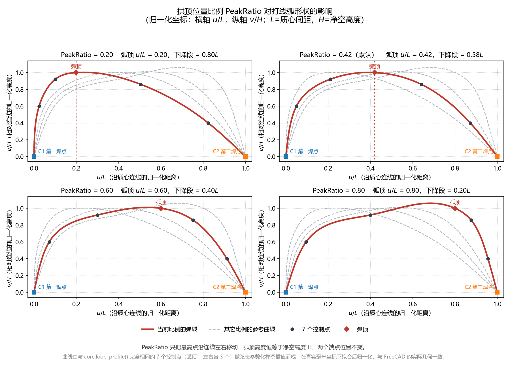

# WireBonder 参数详解

本文逐一说明 WireBonder 面板与参数化对象中的**每一个参数**：它是什么、取值范围、默认值、几何上起什么作用、以及调它会发生什么变化。

> 适用版本 **v0.4.0** ｜ 数据来源：`core.py` 中的 `DEFAULT_*` 常量、`taskpanel.py` 中的控件定义、`settings.py` 中的持久化规则（均为实测值）。

---

## 0. 参数总览

| 分组 | 面板名称 | 属性名 | 单位 | 默认值 | 取值范围 |
| --- | --- | --- | --- | --- | --- |
| 金线参数 | 金线直径 | `WireDiameter` | µm（内部 mm） | 20 µm | 0.1 – 500 µm |
| 金线参数 | 净空高度 | `Clearance` | µm（内部 mm） | 500 µm | 0 – 100000 µm |
| 金线参数 | 走线平面偏转角 | `PlaneRotation` | ° | 0° | −180° – 180° |
| 金线参数 | 平顶长度 | `TopLength` | µm（内部 mm） | 200 µm | 0 – 20000 µm |
| 金线参数 | 进出线距离 | `LeadDistance` | µm（内部 mm） | 10 µm | 0 – 5000 µm |
| 金线参数 | 拱顶位置比例 | `PeakRatio` | — | 0.42 | 0.05 – 0.95 |
| 金线参数 | 出线陡升比例 | `RiseRatio` | — | 0.60 | 0 – 1 |
| 金线参数 | 落线高度比例 | `FallRatio` | — | 0.20 | 0 – 0.60 |
| 金线参数 | 焊球形状 | `BallMode` | — | 球形 | 无 / 球形 / 圆台 |
| 金线参数 | 焊球直径（球形；圆台时兼作高度） | `BallDiameter` | µm（内部 mm） | 50 µm | 1 – 20000 µm |
| 金线参数 | 上底直径 | `BallTopDiameter` | µm（内部 mm） | 50 µm | 1 – 20000 µm |
| 金线参数 | 下底直径 | `BallBottomDiameter` | µm（内部 mm） | 50 µm | 1 – 20000 µm |
| 输出选项 | 生成金线实体 | `MakeSolid` | 布尔 | 否 | 勾选 / 不勾选 |
| 输出选项 | 同时显示中心线 | `ShowCentreline` | 布尔 | 是 | 勾选 / 不勾选 |
| 输出选项 | 生成焊球 | `MakeBalls` | 布尔 | 是 | 勾选 / 不勾选 |
| 输出选项 | 创建平分辅助面 | `CreatePlane` | 布尔 | 否 | 勾选 / 不勾选 |
| 辅助面对象 | 外扩量 | `Margin` | mm | 2.0 | 无面板控件 |
| 辅助面对象 | 半宽系数 | `WidthFactor` | — | 0.35 | 无面板控件 |

> **面板会记住上次的设置**：点 OK 后所有参数写入 FreeCAD 用户参数，下次打开自动回填。因此你看到的值可能不是上表的默认值，而是上次使用的值。点面板底部的 **恢复默认值** 可回到上表取值。
>
> **面板布局**：内容过高时自动出现垂直滚动条，控件不会被截断；点击分组标题（选中的平面 / 金线参数 / 输出选项）可折叠该分组，**▾** 表示展开、**▸** 表示折叠，折叠状态同样会被记住。
>
> ⚠ 长度参数以 **mm** 存储（FreeCAD 原生单位），面板以 **µm** 显示与输入：`1 µm = 0.001 mm`。

---

## 1. 几何背景（读懂下面各参数的前提）

选中两个面 F1、F2 后，插件做三件事：

1. 取两面**质心** C1、C2，得到**连线**，长度为 `L`；
2. 取两面**法线**的角平分方向，配上连线方向，张成**走线平面**（平分平面）；
3. 在走线平面内画一条**打线弧**，从 C1 到 C2，最后按线径**放样**成实体。

```
                     弧顶 (u = peak_ratio × L,  v = clearance)
                          ___
                        /     \
   C1 ●---------------/         \---------------● C2
      (0,0)      u —— 沿连线距离 ——►        (L, 0)
                   v —— 相对连线的高度 ——►
```

- `u`：沿连线的距离，从 C1 起算，`0 → L`
- `v`：相对连线的高度，从连线起算，`0 → clearance`
- 弧线由 **8 个控制点**插值成平滑样条，**严格穿过 C1 与 C2**，并整体落在走线平面内

线形按真实打线轮廓组织成四段：**弧线上扬 → 平顶 → 长直下降 → 落地圆角**：

```
       lead         top_length            lead
   C1 ---*      *---------*---------*      *--- C2
   (上扬) \    /  (平顶起点)(中点)(终点) \   / (落地)
           \__/                          \_/
         (圆弧)          (直线下降)      (圆角)
```

| # | 控制点 | 位置 `u` | 高度 `v` |
| --- | --- | --- | --- |
| 1 | C1 第一焊点 | `0` | `0` |
| 2 | 出线点 | `lead`（进出线距离，默认 10 µm） | `rise_ratio × clearance` |
| 3 | 平顶起点 | `peak_u − top_length/2` | `clearance` |
| 4 | **平顶中点** | `peak_u = peak_ratio × L` | `clearance` |
| 5 | 平顶终点 | `peak_u + top_length/2` | `clearance` |
| 6 | 下降段中点 | 平顶终点与落线点的中点 | **落在 5→7 连线上**（共线） |
| 7 | 落线点 | `L − lead` | `fall_ratio × clearance` |
| 8 | C2 第二焊点 | `L` | `0` |

> 第 7 点实际取 `min(0.6, fall_ratio × 2) × clearance`。

**两条关键的设计规则**（都经过实测验证）：

1. **第 6 点与第 5、7 点共线** —— 三点共线会让自然样条的二阶导数为零，因此下降段是**真正的直线**，
   而不是向外鼓出的弧。实测下降段相对直线的最大偏差仅约 **3 µm**（下降高度的 3%）。
2. **平顶由 3 个点支撑**（而不是 2 个）—— 样条在只有两个平顶点时会在过渡处上拱，
   实测**最高点超出设定净空 6.8%**；加到 3 个点后降到 **1.8%**，让"净空高度"这个参数可信。

---

## 2. 金线直径 `WireDiameter`

| 项目 | 内容 |
| --- | --- |
| 面板名称 | 金线直径 |
| 单位 / 默认 | µm / **20 µm** |
| 范围 | 0.1 – 500 µm |
| 作用 | 沿弧线放样所用圆的**直径**，即金线本身的粗细 |

**做什么用**：决定金线的真实几何粗细。常见金线规格 18–25 µm，默认 20 µm 是典型值。

**调大/调小会怎样**：

- 调大 → 线更粗，实体体积按 `π·r²·L` 平方增长，**干涉检查更有意义**（例如检查与盖板的间隙）
- 调小 → 更接近真实，但 OCCT 放样代价上升（见下方性能提示）

**与其他参数的关系**：与弧线形状无关，只改变截面尺寸。当勾选「生成金线实体」时才实际生效；不勾选时只用它无关（只画中心线）。

> **性能提示**：0.02 mm 直径 × 约 100 mm 路径的放样实测约需 **1 分钟**（OCCT 在小半径长路径下需要很小容差）。建议先用中心线确定走向，最后再生成实体，或临时放大直径试算。

---

## 3. 净空高度 `Clearance`

| 项目 | 内容 |
| --- | --- |
| 面板名称 | 净空高度 |
| 单位 / 默认 | µm / **500 µm** |
| 范围 | 0 – 100000 µm |
| 作用 | 弧顶**相对两质心连线**的高度，即弧线的最大高度 |

**做什么用**：这是打线工艺里最关键的尺寸之一——线弧必须高过芯片表面与边缘，避免压到或擦到芯片与邻近结构。**调它就是调"线有多高"**。

**调大/调小会怎样**：

- 调大 → 弧顶更高，`v` 方向整体抬高，干涉风险降低，但线更长、电阻与弧垂更大
- 设为 `0` → 退化为一条沿连线的**直线**（弧顶与两端同高）
- 过大 → 弧线形状会变得很夸张，面板会给出橙色提醒

**注意**：这里的"高度"是**相对两质心连线**，不是相对元器件表面。若两个焊盘本身不在同一高度（存在落差），连线与表面存在夹角，需要自己换算：

```
相对元器件表面的实际高度 ≈ clearance（沿连线法向）而不是沿竖直方向
```

**面板保护**：当 `净空高度 > 两质心间距 L` 时，面板顶部会显示

```
注意: 净空高度 (500 µm) 大于两质心间距 (393 µm),
生成的弧线会比较夸张, 建议减小净空高度。
```

这通常意味着两个人选的面离得很近（或选错了面）。

---

## 4. 走线平面偏转角 `PlaneRotation`

| 项目 | 内容 |
| --- | --- |
| 面板名称 | 走线平面偏转角 |
| 单位 / 默认 | ° / **0°** |
| 范围 | −180° – 180°（步进 5°） |
| 作用 | 把**整个走线平面**绕两质心连线旋转该角度 |

**做什么用**：默认情况下金线所在的平面是"连线 + 法线角平分"唯一确定的。偏转角让你把这个平面**绕连线转开**，从而：

- **绕开障碍**：弧顶方向可旋转，避开上方的盖板、相邻线弧或元器件；
- **配合打线机走线方向**：真实打线机的劈刀有固定的进出方向，偏转后弧线不再正好"正上/正前"拱起；
- **让两条线错开**：并排两根线时给不同偏转角可避免贴在一起。

**几何定义**：θ 只影响局部 y、z 轴，绕 x（连线）旋转：

```
y' = Rot(x, θ) · y        # 弧顶方向随之改变
z' = Rot(x, θ) · z        # 平面法向随之改变
```

**调它不会改变**：两个质心的位置、连线方向与长度 `L`、净空高度的数值（`v` 仍从 0 到 clearance，只是从另一个方向量起）。

**实测一致性（0° 与 30° 对比）**：

```
连线方向不变   : True
连线长度不变   : 101.607086 -> 101.607086 mm
ydir 夹角      : 30.000°
zdir 夹角      : 30.000°
偏转后仍正交   : True
曲线包围盒(0°) : Y[5.000, 5.000]      ← 完全落在原平面内
曲线包围盒(30°): Y[4.729, 5.000]      ← 随平面偏转
起点/终点      : (5,5,2) -> (105,5,20)  ← 端点始终是质心
```

**0° 即为默认**：与原平分平面完全重合。

---

## 5. 拱顶位置比例 `PeakRatio`

| 项目 | 内容 |
| --- | --- |
| 面板名称 | 拱顶位置比例 |
| 单位 / 默认 | 无量纲 / **0.42** |
| 范围 | 0.05 – 0.95（步进 0.05） |
| 作用 | 弧**最高点**沿连线方向的位置 |

**几何定义**：

```
peak_u = peak_ratio × L        # 弧顶沿连线的位置
tail   = L − peak_u            # 弧顶到第二焊点的剩余长度
```

对应控制点表的第 4 个点 `(peak_u, clearance)`。

**做什么用**：净空高度管"**线有多高**"，本参数管"**高点在哪儿**"。

- **0.5**：对称拱形（弧顶在正中）
- **< 0.5**（默认 0.42）：弧顶偏**第一焊点**一侧 —— 出线后较快拱起，随后长距离缓落，这正是真实打线机 loop 的形态（ball bond 侧陡起）
- **> 0.5**：弧顶偏第二焊点，下降段变陡

### 线形与参考图对照


> 上图按参考图比例（`L′ = 700 µm`、`H′ = 150 µm`）绘制：红色为生成的弧线，
> 灰色虚线为参考图的关键点（简化）。可以看到**平顶平台**、**长直下降段**与两端的圆角
> 都与参考图一致。该图由 [`scripts/compare_profile.py`](../scripts/compare_profile.py) 生成，
> 同时会打印平顶跨度、下降段斜率与"偏离直线"比例等指标。
>
> 调参扫描脚本：[`scripts/scan_top_length.py`](../scripts/scan_top_length.py)。

### 示意图（不同 PeakRatio）



> 四个子图分别是 `PeakRatio` = 0.20 / 0.42（默认）/ 0.60 / 0.80；红色实线为当前比例，
> 灰色虚线为其它比例作参照，黑点为 7 个控制点，菱形标记弧顶位置。
> 横轴 `u/L`、纵轴 `v/H` 均为归一化坐标，因此图形与具体的连线长度、净空高度无关。
>
> 该图由 [`scripts/plot_peak_ratio.py`](../scripts/plot_peak_ratio.py) 用 **Python + Matplotlib**
> 生成（只依赖 NumPy，不需要 SciPy）：脚本复用与 [`core.loop_profile()`](../src/WireBonder/core.py)
> **完全相同**的 7 个控制点公式，再用弦长参数化的三次样条平滑，与 FreeCAD 的
> `Part.BSplineCurve.interpolate()` 行为一致（并且在真实毫米坐标下拟合后再归一化，
> 避免缩放影响弦长参数）。重新生成：

```bash
python scripts/plot_peak_ratio.py
```

**实测影响（L = 2 mm、净空 500 µm）**：

| 比例 | 弧顶位置 | 弧顶占比 | 下降段 `tail` | 效果 |
| --- | --- | --- | --- | --- |
| 0.20 | 0.400 mm | 20% | 1.600 mm | 立刻拱起，长而缓的下降段 |
| **0.42** | 0.840 mm | 42% | 1.160 mm | 默认，接近真实打线形态 |
| 0.60 | 1.200 mm | 60% | 0.800 mm | 弧顶偏后，下降段变陡 |
| 0.80 | 1.600 mm | 80% | 0.400 mm | 弧顶紧贴第二焊点 |

对应的 7 个控制点（0.42 时）：

```
[(0, 0), (0.101, 0.30), (0.42, 0.46), (0.84, 0.50),
 (1.281, 0.43), (1.745, 0.20), (2.0, 0)]
       ↑ 左侧 3 点            ↑ 弧顶      ↑ 右侧 3 点
```

**调它不会改变**：净空高度的**数值**不变（弧顶依然精确等于 clearance），两个端点位置不变，总跨度不变。只是最高点在水平方向上左右移动，并把整个弧线形状一起平移变形。

> 图中可直观看到这一点：四条曲线的最高点高度都是 `v/H = 1.00`，左右两个端点都精确落在
> `u/L = 0` 与 `u/L = 1.0` 上，只有弧顶的横坐标随比例移动。

### 关于落线段的形态（7 点方案的设计考虑）

早期版本使用 8 个控制点，末段的落线点距离 C2 太近（`u = peak_u + 0.92·tail`），
导致那一段又短又陡，**插值样条为了穿过这些点会向外鼓出，越过 C2 再折回**：

| PeakRatio | 8 点方案：越过 C2 的最大距离 |
| --- | --- |
| 0.20 | 0.00000 mm |
| 0.42（默认） | 0.00000 mm |
| 0.60 | 0.00575 mm |
| 0.80 | **0.02416 mm** |

现版本把控制点减为 **7 个**（弧顶 + 左右各 3 个），并把末段的落线点前移到
`u = peak_u + 0.78·tail`，使"落线点 → C2"这一段明显变长、变缓：

| PeakRatio | tail | 落线点位置 | 落线点 → C2 间距 | 该段坡度 | 越过 C2 的距离 |
| --- | --- | --- | --- | --- | --- |
| 0.20 | 1.600 mm | (1.6480, 0.200) | 0.4049 mm | 0.57 | **0.00000 mm** |
| **0.42** | 1.160 mm | (1.7448, 0.200) | 0.3242 mm | 0.78 | **0.00000 mm** |
| 0.60 | 0.800 mm | (1.8240, 0.200) | 0.2664 mm | 1.14 | **0.00000 mm** |
| 0.80 | 0.400 mm | (1.9120, 0.200) | 0.2185 mm | 2.27 | **0.00000 mm** |

> 上表为 `L = 2 mm`、净空 `500 µm` 下，用 FreeCAD 真实曲线采样的结果
> （`core.build_centreline()` 生成后按参数采样 3001 点）。

末段坡度从原来的 1.56–6.25 降到 0.57–2.27，**过冲完全消除**：所有 `PeakRatio`
取值下曲线都不再越过 C2，"线扎进焊点再折回"的现象不复存在。

**代价与取舍**

控制点减少一个、落线点前移，带来两个可预期的变化：

- **落线更斜**：到达 C2 时曲线不再垂直向下，而是带有一定的前进分量（`PeakRatio = 0.42`
  时约 +48°）。这与真实打线机的第二焊点压合姿态不同，属于用"形状平滑"换取
  "不过冲"的取舍；
- **可调性降低**：落线姿态现在由固定的 `FALL_POSITION = 0.78` 与面板的「落线高度比例」
  共同决定，不再有独立的水平位置参数。

**实用结论**

- 若你更看重**落线垂直、贴近真实焊点姿态**，把「落线高度比例」调低（如 0.05–0.10），
  曲线会更早贴近连线、以更陡的角度落到 C2；
- 若你更看重**弧线平滑、无回勾**，保持默认即可 —— 7 点方案在任何 `PeakRatio` 下都不会过冲；
- 需要短跨度弧线时，优先**减小净空高度**而不是一味推大 `PeakRatio`。

**什么时候调**：觉得弧线形态不自然、或弧顶恰好顶到某个干涉位置时，优先调它，而不是去改净空高度。

---

## 5.4 平顶长度 `TopLength`

| 项目 | 内容 |
| --- | --- |
| 面板名称 | 平顶长度 |
| 单位 / 默认 | µm / **200 µm** |
| 范围 | 0 – 20000 µm（自动夹紧到跨度的 45%） |
| 作用 | 弧线顶部**平直段**的长度 |

**为什么需要它**：真实打线弧不是尖顶，而是先爬升到一个**平台**，再沿一条**长直线**降到第二焊点 ——
参考图（[`data/wire-sketch.png`](../data/wire-sketch.png)）里那段近乎笔直的下降就是其特征。
本参数控制这个平台有多长。

**参数间的联动**：平顶是**绝对长度**，而两个进出线点之间的可用跨度随连线长度变化，
所以：

```
可用跨度 = L − 2 × lead
平台占一段，剩下的全部给长直下降段
→ 平顶越长，下降段越短、越陡
```

**实测（L = 700 µm、弧高 150 µm、进出线 60 µm）**：

| 平顶长度 | 下降段长度 | 下降斜率 | 下降段偏离直线 |
| --- | --- | --- | --- |
| 50 µm | 366 µm | 0.25 | 4.5% |
| 100 µm | 316 µm | 0.28 | 4.1% |
| **200 µm（默认）** | 216 µm | 0.34 | 3.6% |
| 310 µm | 106 µm | 0.43 | 2.7% |

> 斜率随平顶变陡、也随跨度变缓（这是几何必然：同样弧高、跨度越长越平缓）。
> 参考图的比例是 `top ≈ 0.3 × L`；本参数取绝对值是为了让"平台长度"在不同跨度下含义一致。

**自动夹紧**：平顶同时受两侧约束 —— 不能超出跨度的 45%，也不能让平台起点越过进球点、
或让平台终点越过落线点：

```
half_top = min(top/2, 0.45L/2, min(peak_u − lead, (L − lead) − peak_u) × 0.98)
```

取两侧可用空间**较小者**并保留 2% 余量，确保 8 个控制点的 `u` 始终严格递增。
实测 1680 组「跨度 × 峰值比例 × 平顶长度 × 进出线距离」组合**全部合法**。
（早期版本只限制了 45%，当 `peak_ratio` 很小或很大时平台会越界，控制点顺序被打乱。）

---

## 5.5 进出线距离 `LeadDistance`

| 项目 | 内容 |
| --- | --- |
| 面板名称 | 进出线距离 |
| 单位 / 默认 | µm / **10 µm** |
| 范围 | 0 – 5000 µm |
| 作用 | 每个焊盘到其**进出线控制点**的水平距离，直接决定金线离开 C1 与落入 C2 的角度 |

**几何定义**：本参数用**绝对距离**（而不是比例）定位第 2 与第 6 个控制点：

```
p2.u = lead                       # 距离 C1 的水平距离
p6.u = L − lead                   # 距离 C2 的水平距离
```

这样一来，进出线的斜率就由「高度比例 ÷ 距离」直接决定：

```
出线斜率 ≈ rise_ratio × clearance / lead
落线斜率 ≈ fall_ratio × clearance / lead
```

**为什么需要它**：出线/落线高度比例只告诉程序"线在距焊点多远处已经爬升了多少"，而"多远"过去是按连线长度比例算的 —— 连线变长时进出线会自动变缓。改成绝对距离后，**进出线角度只由高度比例与这个距离决定，与连线长短无关**。

**实测（L = 2 mm、净空 500 µm、rise/fall = 0.60/0.20）**：

| 进出线距离 | 第 2 点位置 | 第 6 点位置 | 出线斜率 | 落线斜率 | 实测出线角 | 实测落线角 |
| --- | --- | --- | --- | --- | --- | --- |
| 2 µm | 0.0020 mm | 1.9980 mm | 150.0 | 100.0 | −23.4° | −14.5° |
| **10 µm（默认）** | 0.0100 mm | 1.9900 mm | 30.0 | 20.0 | −21.9° | −12.2° |
| 50 µm | 0.0500 mm | 1.9500 mm | 6.0 | 4.0 | −14.5° | −0.8° |
| 200 µm | 0.2000 mm | 1.8000 mm | 1.5 | 1.0 | — | — |

> 角度以"垂直"为 0°；数值为 FreeCAD 真实曲线在端点处采样的切线方向。

**调大/调小会怎样**：

- **调小** → 控制点贴近焊点，进出线更陡、几乎垂直落下（默认 10 µm 已属很陡）
- **调大** → 进出线更平缓，弧线在焊点附近就开始斜着爬升/下降
- 设为 `0` → 回退到默认值（10 µm），避免出现零长度段

**自动夹紧**：极端取值下代码会把该距离限制在 `peak_u` 与 `tail` 的 45% 以内，保证 7 个控制点始终按 `u` 递增排列。实测 `lead = 10 mm`、`peak_ratio = 0.10` 时自动夹到 0.09 mm，控制点顺序仍然合法。

---

## 6. 出线陡升比例 `RiseRatio`

| 项目 | 内容 |
| --- | --- |
| 面板名称 | 出线陡升比例 |
| 单位 / 默认 | 无量纲 / **0.60** |
| 范围 | 0 – 1（步进 0.05） |
| 作用 | **刚离开第一焊点**时，线高度上升的快慢 |

**几何定义**：控制点表中第 2 个点：

```
(0.12 × peak_u, min(1.0, rise_ratio) × clearance)
```

即"刚走完出线段的 12% 处，线已经爬升到净空高度的多少倍"。

**做什么用**：模拟打线机**第一焊点（ball bond）处的陡升**——劈刀压出焊球后迅速抬起，线在很短的水平距离内几乎垂直上升。

**调大/调小会怎样**：

- **调大（如 0.9）** → 出线更"陡"：几乎贴着焊点直上，随后才走向弧顶，形态更像真实 ball bond
- **调小（如 0.2）** → 出线更"缓"：从焊点起就开始斜着爬升，弧线更饱满圆润
- **设为 0** → 起点附近几乎是贴着连线水平出线，实际中很少用

**只影响起点侧**：对弧顶高度、弧顶位置、落线姿态均无影响。

**工艺提示**：陡升过大（接近 1.0）在真实工艺中可能意味着线在焊球根部弯折过急（颈缩风险），做工艺评估时可以适当降低。

---

## 7. 落线高度比例 `FallRatio`

| 项目 | 内容 |
| --- | --- |
| 面板名称 | 落线高度比例 |
| 单位 / 默认 | 无量纲 / **0.20** |
| 范围 | 0 – 0.60（步进 0.05） |
| 作用 | **接近第二焊点**时，线的高度位置 |

**几何定义**：控制点表中第 7 个点：

```
(peak_u + 0.92 × tail,  min(0.6, fall_ratio × 2.0) × clearance)
```

注意代码对输入做了 `min(0.6, fall_ratio × 2)` 的映射，所以：

| 面板输入 | 实际生效系数 | 该点高度（净空 500 µm 时） |
| --- | --- | --- |
| 0.05 | 0.10 | 50 µm |
| 0.20（默认） | 0.40 | 200 µm |
| 0.30 | 0.60 | 300 µm |
| ≥ 0.30 | 0.60（封顶） | 300 µm |

**做什么用**：控制**落线姿态**。真实打线机在接近第二焊点时不会直接砸下去，而是保有某个高度再压合。

**调大/调小会怎样**：

- **调大** → 线到第二焊点前仍保持较高高度，随后较陡地落下
- **调小（趋近 0）** → 早早贴近连线，落线段又长又平
- 上限被设计为 0.60，避免落线过于生硬（超过 0.30 后不再变化）

**只影响终点侧**：与出线侧、弧顶位置无关。

---

## 8. 焊球形状与尺寸

焊点处的凸起（bond bump）在**起点与终点各有一个下拉框**，可以分别设置 —— 例如芯片端用球形、基板端用圆台。面板会**按两端所选形状合并显示需要的字段**。

| 下拉选项 | 属性值 |
| --- | --- |
| **无** | `none` |
| **球形** | `sphere` |
| **圆台** | `frustum` |

**字段显隐规则**（两端一起考虑，因为直径字段是共用的）：

| 起点 C1 | 终点 C2 | 焊球直径行 | 上下底直径行 |
| --- | --- | --- | --- |
| 无 | 无 | 隐藏 | 隐藏 |
| 球形 | 无 | 显示 | 隐藏 |
| 圆台 | 无 | 隐藏 | 显示 |
| 球形 | 圆台 | **显示** | **显示** |
| 无 | 圆台 | 隐藏 | 显示 |

（属性视图中的对应字段为 `StartBallMode`（C1）、`EndBallMode`（C2），以及共用的 `BallDiameter`、`BallTopDiameter`、`BallBottomDiameter`。旧属性 `BallMode` 仍保留：只有当两端形状相同时它才等于该形状，否则给出一个合并值，保证旧脚本仍可用。）

### 球形 `sphere`

| 项目 | 内容 |
| --- | --- |
| 参数 | 焊球直径 `BallDiameter` |
| 默认 | 50 µm（约线径的 2.5 倍） |
| 作用 | 在两个质心处各生成一个球体，代表第一焊点压出的 ball bond |

体积校验（50 µm，半径 25 µm）：`0.0000654498 mm³`，与 `4/3·π·r³` 完全一致，球心落在两个面的质心。

### 圆台 `frustum`

| 项目 | 内容 |
| --- | --- |
| 参数 | 上底直径 `BallTopDiameter`、下底直径 `BallBottomDiameter`（默认均为 50 µm） |
| 高度 | 由「焊球直径」`BallDiameter` 兼职，即高度 = 该值 |
| 作用 | 生成一个**截锥**（truncated cone）代替球体，用来表示楔形焊点（wedge bond）或压扁的焊点 |

**定向**：圆台沿**该焊盘的外法线**摆放 —— 下底（`BallBottomDiameter`）贴在焊盘上，上底（`BallTopDiameter`）朝外。实测：法线为 +Z 时凸台位于 `z[0, 0.05]`，法线为 −Z 时位于 `z[-0.05, 0]`。

体积校验（下底 φ80 µm、上底 φ30 µm、高 50 µm）：`0.000126973 mm³`，
与 `π·h/3·(R² + Rr + r²)` 完全一致。

典型用法：下底略大于上底可表示楔形压痕；上下底相等则退化为**圆柱**。

### 兼容开关「生成焊球」

「输出选项」里的 **生成焊球** 复选框保留为快捷开关：

- 取消勾选 → 形状直接变成 **无**（记住之前的形状）
- 重新勾选 → 恢复到之前选的形状（默认球形）

它与下拉框**双向联动**，实测：选中球形后取消勾选 → 形状变 `none` 且直径行隐藏；重新勾选 → 回到 `sphere` 且直径行重新出现。

**与线径的关系**：焊球尺寸不会随线径自动变化，需要自行把握比例。

---

## 9. 复选框（输出选项）

| 面板名称 | 属性 | 默认 | 作用与取舍 |
| --- | --- | --- | --- |
| 生成金线实体 | `MakeSolid` | **否** | 勾选后生成**真实直径的实体**（按线径放样）。不勾选只生成中心线。细直径放样较慢（20 µm × 100 mm 约 1 分钟），所以默认关闭 |
| 同时显示中心线 | `ShowCentreline` | **是** | 勾选后在实体之外**同时保留中心线**。20 µm 的实体在整机尺度下几乎看不见，中心线用金色细线示意走线，便于摆位 |
| 生成焊球 | `MakeBalls` | **是** | 快捷开关：取消即把**两端形状都设为「无」**，重新勾选恢复两端各自的形状（详见 §8） |
| 创建平分辅助面 | `CreatePlane` | **否** | 额外生成 `WireBondPlane` 平分面对象（半透明绿色，生成后**自动隐藏**，供构造参考）。默认关闭以减少模型树中的对象数量 |

**组合建议**：

| 目的 | 建议组合 |
| --- | --- |
| 快速示意布局 | 默认即可（只中心线 + 球形焊点） |
| 干涉检查 / 出图 | 勾选「生成金线实体」，可同时保留中心线 |
| 只看弧线走向 | 中心线保留，「焊球形状」选「无」 |
| 表示楔形焊点 | 「焊球形状」选「圆台」，设上下底直径 |
| 需要检查平分平面 | 勾选「创建平分辅助面」，或直接用 `Create Bisector Plane` 命令（该命令生成的辅助面保持可见） |

---

## 10. 辅助面对象 `WireBondPlane` 的专属参数

这两个参数**没有面板控件**，只在属性编辑器中可改，且只影响辅助面的显示矩形（不影响金线）。

| 属性 | 默认 | 作用 |
| --- | --- | --- |
| `Margin` | 2.0 mm | 矩形在连线**两端各外扩**的尺寸 |
| `WidthFactor` | 0.35 | 矩形**半宽** = 连线长度 × 该系数 |
| `PlaneRotation` | 0° | 与金线的偏转角联动，保持一致 |
| `Face1` / `Face2` | — | 与金线相同的两个面引用 |

---

## 11. 参数持久化

| 项目 | 说明 |
| --- | --- |
| 存储位置 | `User parameter:BaseApp/Preferences/Mod/WireBonder` |
| 写入时机 | 面板点 **OK** 成功后（保存的是面板全部 11 项） |
| 读取时机 | 每次打开面板时自动回填 |
| 存储字段 | `WireDiameter` / `Clearance` / `BallDiameter` / `BallMode` / `StartBallMode` / `EndBallMode` / `BallTopDiameter` / `BallBottomDiameter` / `LeadDistance` / `TopLength` / `PlaneRotation` / `PeakRatio` / `RiseRatio` / `FallRatio` / `MakeSolid` / `ShowCentreline` / `MakeBalls` / `CreatePlane` |
| 容错 | 逐项独立读取，缺失或类型异常时回退内置默认；读取时会把值夹到面板控件合法区间 |
| 重置 | 面板底部 **恢复默认值** 按钮（同时清空存储），或 `Tools ▸ Edit parameters ▸ BaseApp ▸ Preferences ▸ Mod ▸ WireBonder` |

> 持久化的是**面板默认值**，不影响已创建对象——改默认值不会追溯修改既有几何。

---

## 12. 属性编辑器中的输入格式

生成对象后，可在属性编辑器（View ▸ Panels ▸ Property editor）中直接修改，FreeCAD 接受带单位的写法：

| 属性 | 可输入的写法示例 |
| --- | --- |
| `WireDiameter` | `20 um`、`0.02 mm`、`20 µm` |
| `Clearance` | `500 um`、`0.5 mm` |
| `BallDiameter` | `50 um`、`0.05 mm` |
| `BallTopDiameter` / `BallBottomDiameter` | `30 um`、`80 um` |
| `BallMode` / `StartBallMode` / `EndBallMode` | 枚举：`none` / `sphere` / `frustum` |
| `LeadDistance` | `10 um`、`0.01 mm` |
| `TopLength` | `200 um`、`0.2 mm` |
| `PlaneRotation` | `30 deg`、`-45°`、`0.5 rad` |
| `PeakRatio` / `RiseRatio` / `FallRatio` | 纯数字，如 `0.42` |
| `MakeSolid` / `ShowCentreline` / `MakeBalls` | `true` / `false` |

修改任意参数后 FreeCAD 会自动重算并重建几何（必要时按 `Ctrl` + `R`）。

---

## 13. 快速对照：想改变什么 → 调哪个参数

| 想达到的效果 | 调这个 | 不要调 |
| --- | --- | --- |
| 线整体抬高/降低 | 净空高度 `Clearance` | 拱顶位置比例 |
| 高点左右移动、避开干涉 | 拱顶位置比例 `PeakRatio` | 净空高度 |
| 弧线整体绕连线转个方向 | 走线平面偏转角 `PlaneRotation` | 净空高度 |
| 线变粗/变细 | 金线直径 `WireDiameter` | 焊球直径 |
| 不要焊点凸起 | 焊球形状选「无」 | — |
| 焊点改成楔形/压扁 | 焊球形状选「圆台」并设上下底直径 | 焊球直径 |
| 平顶更长/更短 | 平顶长度 `TopLength` | 净空高度 |
| 下降段更陡/更缓 | 平顶长度 `TopLength`（或改跨度） | 净空高度 |
| 出线更陡/更缓 | 出线陡升比例 `RiseRatio` | 拱顶位置比例 |
| 落线更陡/更缓 | 落线高度比例 `FallRatio` | 出线陡升比例 |
| 进出线角度与连线长度解耦 | 进出线距离 `LeadDistance` | 出线陡升比例 |
| 两端用不同焊点形状 | 「起点焊球」「终点焊球」分别选 | — |
| 只要示意、不要实体 | 取消「生成金线实体」 | — |
| 看不清细线 | 勾选（保持）「同时显示中心线」 | — |
| 模型树对象太多 | 取消「创建平分辅助面」 | — |

---

## 14. 相关文档

- 插件功能与用法（中）：[`../src/README-cn.md`](../src/README-cn.md)
- 插件功能与用法（英）：[`../src/README.md`](../src/README.md)
- 设计文档（需求 / 算法 / 数据模型 / 踩坑记录）：[`freecad-wirebonder-prd.md`](freecad-wirebonder-prd.md)
- 安装操作文档：[`../README-cn.md`](../README-cn.md)
- 本文档插图的生成脚本：[`../scripts/plot_peak_ratio.py`](../scripts/plot_peak_ratio.py)
  （依赖 matplotlib + numpy，不需要 FreeCAD 与 SciPy）
