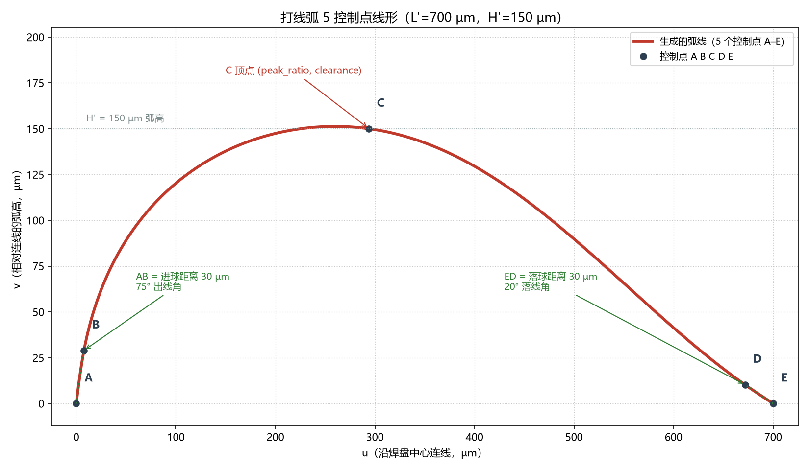

# WireBonder 参数详解

本文逐一说明 WireBonder 面板与参数化对象中的**每一个参数**：它是什么、取值范围、默认值、几何上起什么作用、以及调它会发生什么变化。

> 适用版本 **v0.4.0** ｜ 数据来源：`core.py` 中的 `DEFAULT_*` 常量、`taskpanel.py` 中的控件定义、`settings.py` 中的持久化规则（均为实测值）。

---

## 0. 参数总览

| 分组 | 面板名称 | 属性名 | 单位 | 默认值 | 取值范围 |
| --- | --- | --- | --- | --- | --- |
| 金线参数 | 金线直径 | `WireDiameter` | µm（内部 mm） | 20 µm | 0.1 – 500 µm |
| 金线参数 | 净空高度 | `Clearance` | µm（内部 mm） | 500 µm | 0 – 100000 µm |
| 金线参数 | 走线平面偏转角 | `PlaneRotation` | ° | 0° | −180° – 180° |
| 金线参数 | 进出线距离 | `LeadDistance` | µm（内部 mm） | **30 µm** | 0 – 5000 µm |
| 金线参数 | 拱顶位置比例 | `PeakRatio` | — | 0.42 | 0.05 – 0.95 |
| 金线参数 | 出线角度 | `RiseAngle` | ° | **75°** | 0 – 89° |
| 金线参数 | 落线角度 | `FallAngle` | ° | **20°** | 0 – 89° |
| 金线参数 | 起点焊球 (C1) | `StartBallMode` | — | 球形 | 无 / 球形 / 圆台 |
| 金线参数 | 终点焊球 (C2) | `EndBallMode` | — | 球形 | 无 / 球形 / 圆台 |
| 金线参数 | 焊球直径（球形；圆台时兼作高度） | `BallDiameter` | µm（内部 mm） | 50 µm | 1 – 20000 µm |
| 金线参数 | 上底直径 | `FrustumTopDiameter` | µm（内部 mm） | 50 µm | 1 – 20000 µm |
| 金线参数 | 下底直径 | `FrustumBottomDiameter` | µm（内部 mm） | 50 µm | 1 – 20000 µm |
| 输出选项 | 生成金线实体 | `MakeSolid` | 布尔 | 否 | 勾选 / 不勾选 |
| 输出选项 | 同时显示中心线 | `ShowCentreline` | 布尔 | 是 | 勾选 / 不勾选 |
| 输出选项 | 创建平分辅助面 | `CreatePlane` | 布尔 | 否 | 勾选 / 不勾选 |
| 辅助面对象 | 外扩量 | `Margin` | mm | 2.0 | 无面板控件 |
| 辅助面对象 | 半宽系数 | `WidthFactor` | — | 0.35 | 无面板控件 |

> **面板会记住上次的设置**：点 OK 后所有参数写入 FreeCAD 用户参数，下次打开自动回填。因此你看到的值可能不是上表的默认值，而是上次使用的值。点面板底部的 **恢复默认值** 可回到上表取值。
>
> **面板布局**：内容过高时自动出现垂直滚动条，控件不会被截断；点击分组标题（选中的平面 / 金线参数 / 输出选项）可折叠该分组，**▾** 表示展开、**▸** 表示折叠，折叠状态同样会被记住。
>
> ⚠ 长度参数以 **mm** 存储（FreeCAD 原生单位），面板以 **µm** 显示与输入：`1 µm = 0.001 mm`。

---

## 1. 几何背景（读懂下面各参数的前提）

选中两个面 F1、F2 后，插件做三件事：

1. 取两面**质心** C1、C2，得到**连线**，长度为 `L`；
2. 取两面**法线**的角平分方向，配上连线方向，张成**走线平面**（平分平面）；
3. 在走线平面内画一条**打线弧**，从 C1 到 C2，最后按线径**放样**成实体。

```
                            C 顶点 (u = peak_ratio × L,  v = clearance)
                            *
                          /   \
       B *              /       \              * D
        /              /         \              \
   A ●-/-------------/             \--------------● E
      (0,0)      u —— 沿连线距离 ——►          (L, 0)
                   v —— 相对连线的高度 ——►
```

- `u`：沿连线的距离，从 A 起算，`0 → L`
- `v`：相对连线的高度，从连线起算，`0 → clearance`
- 弧线由 **5 个控制点**插值成平滑样条，**严格穿过两个焊盘质心**，并整体落在走线平面内

线形由 **上扬 → 顶点 → 下降** 三段构成，进出线姿态由**角度**直接控制：

```
                    C  (顶点)
                    *
                  /   \
    B *          /     \          * D
     /          /       \          \
    A *--------/         \----------* E
   起点                              终点
```

| # | 控制点 | 位置 `u` | 高度 `v` |
| --- | --- | --- | --- |
| **A** | 起点（第一个焊盘） | `0` | `0` |
| **B** | 上起点 | `lead × cos(rise_angle)` | `lead × sin(rise_angle)` |
| **C** | **顶点** | `peak_u = peak_ratio × L` | `clearance` |
| **D** | 上终点 | `L − lead × cos(fall_angle)` | `lead × sin(fall_angle)` |
| **E** | 终点（第二个焊盘） | `L` | `0` |

> 完整定义（坐标系、角度基准、推导与取舍）见 **[`spline-ctrl-points.md`](spline-ctrl-points.md)**。
>
> **角度基准**：`rise_angle` / `fall_angle` 都以 **A–E 连线**为基准 —— 0° 指向另一个焊盘，
> 90° 垂直于连线（正上方）。因此角度直接表达"线以多陡的姿态离开/落到焊盘"。
> 角度上限为 89°，避免 B/D 与 A/E 的 `u` 重合而破坏参数的严格递增。
>
> **本版本的取舍**：5 个控制点带来了直观的参数与更小的过冲（顶点高度误差仅 **+0.0%~+0.8%**），
> 代价是**没有真正的平顶**（顶部 2% 以内的平台约 110–160 µm）且**下降段外凸约 14%**
> （此前 8 点方案借助三点共线可做到 3%）。原因：C 与 E 之间只有一个控制点 D。

---

## 2. 金线直径 `WireDiameter`

| 项目 | 内容 |
| --- | --- |
| 面板名称 | 金线直径 |
| 单位 / 默认 | µm / **20 µm** |
| 范围 | 0.1 – 500 µm |
| 作用 | 沿弧线放样所用圆的**直径**，即金线本身的粗细 |

**做什么用**：决定金线的真实几何粗细。常见金线规格 18–25 µm，默认 20 µm 是典型值。

**调大/调小会怎样**：

- 调大 → 线更粗，实体体积按 `π·r²·L` 平方增长，**干涉检查更有意义**（例如检查与盖板的间隙）
- 调小 → 更接近真实，但 OCCT 放样代价上升（见下方性能提示）

**与其他参数的关系**：与弧线形状无关，只改变截面尺寸。当勾选「生成金线实体」时才实际生效；不勾选时只用它无关（只画中心线）。

> **性能提示**：0.02 mm 直径 × 约 100 mm 路径的放样实测约需 **1 分钟**（OCCT 在小半径长路径下需要很小容差）。建议先用中心线确定走向，最后再生成实体，或临时放大直径试算。

---

## 3. 净空高度 `Clearance`

| 项目 | 内容 |
| --- | --- |
| 面板名称 | 净空高度 |
| 单位 / 默认 | µm / **500 µm** |
| 范围 | 0 – 100000 µm |
| 作用 | 弧顶**相对两质心连线**的高度，即弧线的最大高度 |

**做什么用**：这是打线工艺里最关键的尺寸之一——线弧必须高过芯片表面与边缘，避免压到或擦到芯片与邻近结构。**调它就是调"线有多高"**。

**调大/调小会怎样**：

- 调大 → 弧顶更高，`v` 方向整体抬高，干涉风险降低，但线更长、电阻与弧垂更大
- 设为 `0` → 退化为一条沿连线的**直线**（弧顶与两端同高）
- 过大 → 弧线形状会变得很夸张，面板会给出橙色提醒

**注意**：这里的"高度"是**相对两质心连线**，不是相对元器件表面。若两个焊盘本身不在同一高度（存在落差），连线与表面存在夹角，需要自己换算：

```
相对元器件表面的实际高度 ≈ clearance（沿连线法向）而不是沿竖直方向
```

**面板保护**：当 `净空高度 > 两质心间距 L` 时，面板顶部会显示

```
注意: 净空高度 (500 µm) 大于两质心间距 (393 µm),
生成的弧线会比较夸张, 建议减小净空高度。
```

这通常意味着两个人选的面离得很近（或选错了面）。

---

## 4. 走线平面偏转角 `PlaneRotation`

| 项目 | 内容 |
| --- | --- |
| 面板名称 | 走线平面偏转角 |
| 单位 / 默认 | ° / **0°** |
| 范围 | −180° – 180°（步进 5°） |
| 作用 | 把**整个走线平面**绕两质心连线旋转该角度 |

**做什么用**：默认情况下金线所在的平面是"连线 + 法线角平分"唯一确定的。偏转角让你把这个平面**绕连线转开**，从而：

- **绕开障碍**：弧顶方向可旋转，避开上方的盖板、相邻线弧或元器件；
- **配合打线机走线方向**：真实打线机的劈刀有固定的进出方向，偏转后弧线不再正好"正上/正前"拱起；
- **让两条线错开**：并排两根线时给不同偏转角可避免贴在一起。

**几何定义**：θ 只影响局部 y、z 轴，绕 x（连线）旋转：

```
y' = Rot(x, θ) · y        # 弧顶方向随之改变
z' = Rot(x, θ) · z        # 平面法向随之改变
```

**调它不会改变**：两个质心的位置、连线方向与长度 `L`、净空高度的数值（`v` 仍从 0 到 clearance，只是从另一个方向量起）。

**实测一致性（0° 与 30° 对比）**：

```
连线方向不变   : True
连线长度不变   : 101.607086 -> 101.607086 mm
ydir 夹角      : 30.000°
zdir 夹角      : 30.000°
偏转后仍正交   : True
曲线包围盒(0°) : Y[5.000, 5.000]      ← 完全落在原平面内
曲线包围盒(30°): Y[4.729, 5.000]      ← 随平面偏转
起点/终点      : (5,5,2) -> (105,5,20)  ← 端点始终是质心
```

**0° 即为默认**：与原平分平面完全重合。

---

## 5. 拱顶位置比例 `PeakRatio`

| 项目 | 内容 |
| --- | --- |
| 面板名称 | 拱顶位置比例 |
| 单位 / 默认 | 无量纲 / **0.42** |
| 范围 | 0.05 – 0.95（步进 0.05） |
| 作用 | 弧**最高点**沿连线方向的位置 |

**几何定义**：

```
peak_u = peak_ratio × L        # 弧顶沿连线的位置
tail   = L − peak_u            # 弧顶到第二焊点的剩余长度
```

对应控制点表的第 4 个点 `(peak_u, clearance)`。

**做什么用**：净空高度管"**线有多高**"，本参数管"**高点在哪儿**"。

- **0.5**：对称拱形（弧顶在正中）
- **< 0.5**（默认 0.42）：弧顶偏**第一焊点**一侧 —— 出线后较快拱起，随后长距离缓落，这正是真实打线机 loop 的形态（ball bond 侧陡起）
- **> 0.5**：弧顶偏第二焊点，下降段变陡

### 线形与参考图对照



> 上图按参考图比例（`L′ = 700 µm`、`H′ = 150 µm`）绘制：红色为生成的弧线，
> 黑点为 5 个控制点 A–E，绿色虚线为定义 B、D 的进出线射线。
> 该图由 [`scripts/compare_profile.py`](../scripts/compare_profile.py) 生成，
> 同时会打印顶点高度误差、顶部平台宽度与下降段偏离直线比例。
>
> 参数扫描脚本：[`scripts/scan_angles.py`](../scripts/scan_angles.py)。

**实测影响（L = 2 mm、净空 500 µm）**：

| 比例 | 顶点位置 `u` | 说明 |
| --- | --- | --- |
| 0.20 | 0.400 mm | 顶点靠前，出线后很快到达最高点，下降段很长 |
| **0.42** | 0.840 mm | 默认，接近真实打线形态 |
| 0.60 | 1.200 mm | 顶点靠后，下降段变短变陡 |

对应的 5 个控制点（0.42 时，单位 mm，进出线按 30 µm / 75° / 20°）：

```
A (0.000, 0.000)
B (0.008, 0.029)
C (0.840, 0.500)
D (1.972, 0.010)
E (2.000, 0.000)
```

**调它不会改变**：两个质心的位置、连线方向与长度 `L`、净空高度的数值（`v` 仍从 0 到 clearance，只是从另一个方向量起）。

**实测一致性（0° 与 30° 对比）**：

```
连线方向不变   : True
连线长度不变   : 101.607086 -> 101.607086 mm
ydir 夹角      : 30.000°
zdir 夹角      : 30.000°
偏转后仍正交   : True
曲线包围盒(0°) : Y[5.000, 5.000]      ← 完全落在原平面内
曲线包围盒(30°): Y[4.729, 5.000]      ← 随平面偏转
起点/终点      : (5,5,2) -> (105,5,20)  ← 端点始终是质心
```

**0° 即为默认**：与原平分平面完全重合。

---

## 5. 拱顶位置比例 `PeakRatio`

| 项目 | 内容 |
| --- | --- |
| 面板名称 | 拱顶位置比例 |
| 单位 / 默认 | 无量纲 / **0.42** |
| 范围 | 0.05 – 0.95（步进 0.05） |
| 作用 | 弧**最高点**沿连线方向的位置 |

**几何定义**：

```
peak_u = peak_ratio × L        # 弧顶沿连线的位置
tail   = L − peak_u            # 弧顶到第二焊点的剩余长度
```

对应控制点表的第 4 个点 `(peak_u, clearance)`。

**做什么用**：净空高度管"**线有多高**"，本参数管"**高点在哪儿**"。

- **0.5**：对称拱形（弧顶在正中）
- **< 0.5**（默认 0.42）：弧顶偏**第一焊点**一侧 —— 出线后较快拱起，随后长距离缓落，这正是真实打线机 loop 的形态（ball bond 侧陡起）
- **> 0.5**：弧顶偏第二焊点，下降段变陡

### 线形与参考图对照


> 上图按参考图比例（`L′ = 700 µm`、`H′ = 150 µm`）绘制：红色为生成的弧线，
> 黑点为 5 个控制点 A–E，绿色虚线为定义 B、D 的进出线射线。
> 该图由 [`scripts/compare_profile.py`](../scripts/compare_profile.py) 生成，
> 同时会打印顶点高度误差、顶部平台宽度与下降段偏离直线比例。
>
> 参数扫描脚本：[`scripts/scan_angles.py`](../scripts/scan_angles.py)。

**实测影响（L = 2 mm、净空 500 µm）**：

| 比例 | 弧顶位置 | 弧顶占比 | 下降段 `tail` | 效果 |
| --- | --- | --- | --- | --- |
| 0.20 | 0.400 mm | 20% | 1.600 mm | 立刻拱起，长而缓的下降段 |
| **0.42** | 0.840 mm | 42% | 1.160 mm | 默认，接近真实打线形态 |
| 0.60 | 1.200 mm | 60% | 0.800 mm | 弧顶偏后，下降段变陡 |
| 0.80 | 1.600 mm | 80% | 0.400 mm | 弧顶紧贴第二焊点 |

对应的 5 个控制点（见 §1）：

```
[(0, 0), (0.101, 0.30), (0.42, 0.46), (0.84, 0.50),
 (1.281, 0.43), (1.745, 0.20), (2.0, 0)]
       ↑ 左侧 3 点            ↑ 弧顶      ↑ 右侧 3 点
```

**调它不会改变**：净空高度的**数值**不变（弧顶依然精确等于 clearance），两个端点位置不变，总跨度不变。只是最高点在水平方向上左右移动，并把整个弧线形状一起平移变形。

> 图中可直观看到这一点：四条曲线的最高点高度都是 `v/H = 1.00`，左右两个端点都精确落在
> `u/L = 0` 与 `u/L = 1.0` 上，只有弧顶的横坐标随比例移动。

## 5.5 进出线距离 `LeadDistance`

| 项目 | 内容 |
| --- | --- |
| 面板名称 | 进出线距离 |
| 单位 / 默认 | µm / **10 µm** |
| 范围 | 0 – 5000 µm |
| 作用 | 每个焊盘到其**进出线控制点**的水平距离，直接决定金线离开 C1 与落入 C2 的角度 |

**几何定义**：本参数用**绝对距离**（而不是比例）定位第 2 与第 6 个控制点：

```
p2.u = lead                       # 距离 C1 的水平距离
p6.u = L − lead                   # 距离 C2 的水平距离
```

这样一来，进出线的斜率就由「高度比例 ÷ 距离」直接决定：

```
B 的高度 = lead × sin(rise_angle)
D 的高度 = lead × sin(fall_angle)
```

也就是说，**距离与角度一确定，进出线的高度（斜率）就随之确定**，
不再需要单独的高度比例参数。

**为什么需要它**：出线/落线高度比例只告诉程序"线在距焊点多远处已经爬升了多少"，而"多远"过去是按连线长度比例算的 —— 连线变长时进出线会自动变缓。改成绝对距离后，**进出线角度只由高度比例与这个距离决定，与连线长短无关**。

**实测（L = 2 mm、净空 500 µm、rise/fall = 0.60/0.20）**：

| 进出线距离 | B 点位置 (u, v) | D 点位置 (u, v) | 出线角 | 落线角 |
| --- | --- | --- | --- | --- | --- | --- |
| 2 µm | 0.0020 mm | 1.9980 mm | 150.0 | 100.0 | −23.4° | −14.5° |
| **10 µm（默认）** | 0.0100 mm | 1.9900 mm | 30.0 | 20.0 | −21.9° | −12.2° |
| 50 µm | 0.0500 mm | 1.9500 mm | 6.0 | 4.0 | −14.5° | −0.8° |
| 200 µm | 0.2000 mm | 1.8000 mm | 1.5 | 1.0 | — | — |

> 角度以"垂直"为 0°；数值为 FreeCAD 真实曲线在端点处采样的切线方向。

**调大/调小会怎样**：

- **调小** → 控制点贴近焊点，进出线更陡、几乎垂直落下（默认 10 µm 已属很陡）
- **调大** → 进出线更平缓，弧线在焊点附近就开始斜着爬升/下降
- 设为 `0` → 回退到默认值（10 µm），避免出现零长度段

**自动保护**：若 `lead × cos(angle)` 过大（角度接近 0° 而距离很长），B（或 D）的 `u` 可能越过 C；
代码会把水平分量夹紧到 C 之前（或之后）留 2% 余量，保证 5 个控制点的 `u` **严格递增**。

---

## 6. 出线角度 `RiseAngle`

| 项目 | 内容 |
| --- | --- |
| 面板名称 | 出线角度 |
| 单位 / 默认 | ° / **75°** |
| 范围 | 0 – 89° |
| 作用 | 金线**离开第一个焊盘**时的方向 |

**角度的基准是 A–E 连线**（不是竖直方向）：

| 角度 | 含义 |
| --- | --- |
| **0°** | 沿连线指向第二个焊盘（水平贴出，不抬起） |
| **45°** | 斜向 45° 离开 |
| **90°** | 垂直于连线（**正上方**切向） |

结合「进出线距离」`LeadDistance`，B 点位置为：

```
B = A + LeadDistance × (cos(RiseAngle), sin(RiseAngle))
```

因此 **B 的高度 = LeadDistance × sin(RiseAngle)** —— 高度不再是独立参数。

**调大/调小会怎样**：

- **调大（更接近 90°）** → 出线更陡、几乎贴着焊盘垂直上升；顶点两侧更对称、顶部平台更宽；
- **调小** → 出线更平缓，线在离开焊盘时就斜着爬升。

**实测（L = 700 µm、弧高 150 µm、进出线 30 µm、落线角 20°）**：

| 出线角 | 顶点高度误差 | 顶部 2% 平台宽 | 下降段偏离直线 |
| --- | --- | --- | --- |
| 45° | +0.2% | 135 µm | 32.9% |
| 60° | +1.1% | 182 µm | 44.1% |
| **75°（默认）** | **+2.7%** | 258 µm | 56.6% |

> 角度上限 89°：恰好 90° 时 B 的 `u` 与 A 重合，样条要求的"参数严格递增"不再成立。

---

## 7. 落线角度 `FallAngle`

| 项目 | 内容 |
| --- | --- |
| 面板名称 | 落线角度 |
| 单位 / 默认 | ° / **20°** |
| 范围 | 0 – 89° |
| 作用 | 金线**到达第二个焊盘**时的方向 |

与出线角度互为镜像：基准是 A–E 连线，但 **0° 指向第一个焊盘**。

```
D = E − LeadDistance × (cos(FallAngle), −sin(FallAngle))
```

**调大/调小会怎样**：

- **调大** → 落线更陡，接近垂直落到焊盘；
- **调小** → 落线更平缓、贴地滑入。

**实测（rise 75°、lead 30 µm）**：

| 落线角 | 顶点高度误差 | 顶部 2% 平台宽 | 下降段偏离直线 |
| --- | --- | --- | --- |
| **20°（默认）** | +0.8% | 124.7 µm | **14.1%** |
| 30° | +0.3% | 123.2 µm | 20.8% |
| 45° | +0.0% | 142.8 µm | 33.3% |
| 60° | +1.0% | 198.6 µm | 45.9% |

> 落线角是**控制下降段笔直度最有效的参数**：20° 时偏离 14%，60° 时已达 46%。
> 默认取 20°，在"落线姿态自然"与"下降段不过分外凸"之间折中。

---

## 8. 焊球形状与尺寸

焊点处的凸起（bond bump）在**起点与终点各有一个下拉框**，可以分别设置 —— 例如芯片端用球形、基板端用圆台。面板会**按两端所选形状合并显示需要的字段**。

| 下拉选项 | 属性值 |
| --- | --- |
| **无** | `none` |
| **球形** | `sphere` |
| **圆台** | `frustum` |

**字段显隐规则**（两端一起考虑，因为直径字段是共用的）：

| 起点 C1 | 终点 C2 | 焊球直径行 | 上下底直径行 |
| --- | --- | --- | --- |
| 无 | 无 | 隐藏 | 隐藏 |
| 球形 | 无 | 显示 | 隐藏 |
| 圆台 | 无 | 隐藏 | 显示 |
| 球形 | 圆台 | **显示** | **显示** |
| 无 | 圆台 | 隐藏 | 显示 |

（属性视图中的对应字段为 `StartBallMode`（C1）、`EndBallMode`（C2），以及共用的 `BallDiameter`、`FrustumTopDiameter`、`FrustumBottomDiameter`。旧属性 `BallMode` 仍保留：只有当两端形状相同时它才等于该形状，否则给出一个合并值，保证旧脚本仍可用。）

### 球形 `sphere`

| 项目 | 内容 |
| --- | --- |
| 参数 | 焊球直径 `BallDiameter` |
| 默认 | 50 µm（约线径的 2.5 倍） |
| 作用 | 在两个质心处各生成一个球体，代表第一焊点压出的 ball bond |

体积校验（50 µm，半径 25 µm）：`0.0000654498 mm³`，与 `4/3·π·r³` 完全一致，球心落在两个面的质心。

### 圆台 `frustum`

| 项目 | 内容 |
| --- | --- |
| 参数 | 上底直径 `FrustumTopDiameter`、下底直径 `FrustumBottomDiameter`（默认均为 50 µm） |
| 高度 | 由「焊球直径」`BallDiameter` 兼职，即高度 = 该值 |
| 作用 | 生成一个**截锥**（truncated cone）代替球体，用来表示楔形焊点（wedge bond）或压扁的焊点 |

**定向**：圆台沿**该焊盘的外法线**摆放 —— 下底（`FrustumBottomDiameter`）贴在焊盘上，上底（`FrustumTopDiameter`）朝外。实测：法线为 +Z 时凸台位于 `z[0, 0.05]`，法线为 −Z 时位于 `z[-0.05, 0]`。

体积校验（下底 φ80 µm、上底 φ30 µm、高 50 µm）：`0.000126973 mm³`，
与 `π·h/3·(R² + Rr + r²)` 完全一致。

典型用法：下底略大于上底可表示楔形压痕；上下底相等则退化为**圆柱**。

**与线径的关系**：焊球尺寸不会随线径自动变化，需要自行把握比例。

---

## 9. 复选框（输出选项）

| 面板名称 | 属性 | 默认 | 作用与取舍 |
| --- | --- | --- | --- |
| 生成金线实体 | `MakeSolid` | **否** | 勾选后生成**真实直径的实体**（按线径放样）。不勾选只生成中心线。细直径放样较慢（20 µm × 100 mm 约 1 分钟），所以默认关闭 |
| 同时显示中心线 | `ShowCentreline` | **是** | 勾选后在实体之外**同时保留中心线**。20 µm 的实体在整机尺度下几乎看不见，中心线用金色细线示意走线，便于摆位 |
| 创建平分辅助面 | `CreatePlane` | **否** | 额外生成 `WireBondPlane` 平分面对象（半透明绿色，生成后**自动隐藏**，供构造参考）。默认关闭以减少模型树中的对象数量 |

**组合建议**：

| 目的 | 建议组合 |
| --- | --- |
| 快速示意布局 | 默认即可（只中心线 + 球形焊点） |
| 干涉检查 / 出图 | 勾选「生成金线实体」，可同时保留中心线 |
| 只看弧线走向 | 中心线保留，「焊球形状」选「无」 |
| 表示楔形焊点 | 「焊球形状」选「圆台」，设上下底直径 |
| 需要检查平分平面 | 勾选「创建平分辅助面」，或直接用 `Create Bisector Plane` 命令（该命令生成的辅助面保持可见） |

---

## 10. 辅助面对象 `WireBondPlane` 的专属参数

这两个参数**没有面板控件**，只在属性编辑器中可改，且只影响辅助面的显示矩形（不影响金线）。

| 属性 | 默认 | 作用 |
| --- | --- | --- |
| `Margin` | 2.0 mm | 矩形在连线**两端各外扩**的尺寸 |
| `WidthFactor` | 0.35 | 矩形**半宽** = 连线长度 × 该系数 |
| `PlaneRotation` | 0° | 与金线的偏转角联动，保持一致 |
| `Face1` / `Face2` | — | 与金线相同的两个面引用 |

---

## 11. 参数持久化

| 项目 | 说明 |
| --- | --- |
| 存储位置 | `User parameter:BaseApp/Preferences/Mod/WireBonder` |
| 写入时机 | 面板点 **OK** 成功后（保存的是面板全部 11 项） |
| 读取时机 | 每次打开面板时自动回填 |
| 存储字段 | `WireDiameter` / `Clearance` / `BallDiameter` / `StartBallMode` / `EndBallMode` / `FrustumTopDiameter` / `FrustumBottomDiameter` / `LeadDistance` / `PlaneRotation` / `PeakRatio` / `RiseAngle` / `FallAngle` / `MakeSolid` / `ShowCentreline` / `MakeBalls` / `CreatePlane` |
| 容错 | 逐项独立读取，缺失或类型异常时回退内置默认；读取时会把值夹到面板控件合法区间 |
| 重置 | 面板底部 **恢复默认值** 按钮（同时清空存储），或 `Tools ▸ Edit parameters ▸ BaseApp ▸ Preferences ▸ Mod ▸ WireBonder` |

> 持久化的是**面板默认值**，不影响已创建对象——改默认值不会追溯修改既有几何。

---

## 12. 属性编辑器中的输入格式

生成对象后，可在属性编辑器（View ▸ Panels ▸ Property editor）中直接修改，FreeCAD 接受带单位的写法：

| 属性 | 可输入的写法示例 |
| --- | --- |
| `WireDiameter` | `20 um`、`0.02 mm`、`20 µm` |
| `Clearance` | `500 um`、`0.5 mm` |
| `BallDiameter` | `50 um`、`0.05 mm` |
| `FrustumTopDiameter` / `FrustumBottomDiameter` | `30 um`、`80 um` |
| `StartBallMode` / `EndBallMode` | 枚举：`none` / `sphere` / `frustum` |
| `LeadDistance` | `10 um`、`0.01 mm` |
| `PlaneRotation` | `30 deg`、`-45°`、`0.5 rad` |
| `PeakRatio` | 纯数字，如 `0.42` |
| `RiseAngle` / `FallAngle` | `75 deg`、`1.31 rad`、`75°` |
| `MakeSolid` / `ShowCentreline` | `true` / `false` |

修改任意参数后 FreeCAD 会自动重算并重建几何（必要时按 `Ctrl` + `R`）。

---

## 13. 快速对照：想改变什么 → 调哪个参数

| 想达到的效果 | 调这个 | 不要调 |
| --- | --- | --- |
| 线整体抬高/降低 | 净空高度 `Clearance` | 拱顶位置比例 |
| 高点左右移动、避开干涉 | 拱顶位置比例 `PeakRatio` | 净空高度 |
| 弧线整体绕连线转个方向 | 走线平面偏转角 `PlaneRotation` | 净空高度 |
| 线变粗/变细 | 金线直径 `WireDiameter` | 焊球直径 |
| 不要焊点凸起 | 焊球形状选「无」 | — |
| 焊点改成楔形/压扁 | 焊球形状选「圆台」并设上下底直径 | 焊球直径 |
| 出线更陡/更缓 | 出线角度 `RiseAngle` | 拱顶位置比例 |
| 落线更陡/更缓 | 落线角度 `FallAngle` | 出线角度 |
| 进出线角度与连线长度解耦 | 进出线距离 `LeadDistance` | 出线角度 |
| 两端用不同焊点形状 | 「起点焊球」「终点焊球」分别选 | — |
| 只要示意、不要实体 | 取消「生成金线实体」 | — |
| 看不清细线 | 勾选（保持）「同时显示中心线」 | — |
| 模型树对象太多 | 取消「创建平分辅助面」 | — |

---

## 14. 相关文档

- 插件功能与用法（中）：[`../src/README-cn.md`](../src/README-cn.md)
- 插件功能与用法（英）：[`../src/README.md`](../src/README.md)
- 设计文档（需求 / 算法 / 数据模型 / 踩坑记录）：[`freecad-wirebonder-prd.md`](freecad-wirebonder-prd.md)
- 安装操作文档：[`../README-cn.md`](../README-cn.md)
- 本文档插图的生成脚本：[`../scripts/plot_peak_ratio.py`](../scripts/plot_peak_ratio.py)
  （依赖 matplotlib + numpy，不需要 FreeCAD 与 SciPy）
