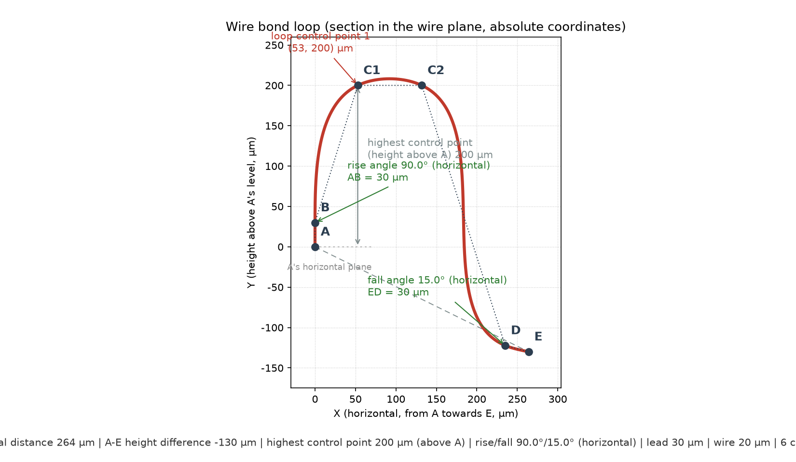

# WireBonder — FreeCAD wire bonding (gold wire) addon

[中文](README.md)

Select any **two faces** and the addon builds their "bisector plane", draws a **wire loop**
connecting the two centroids inside that plane, and finally sweeps it with the configured
**wire diameter** to obtain a solid (optionally with a bond bump at each end).

The wire diameter, the loop control points and everything else are **parametric properties**:
change one and the geometry is rebuilt automatically.

> Version **0.14.0** ｜ tested on **FreeCAD 1.1.3 + Python 3.11.14 + PySide6 6.8.3**.

---

## 1. Geometry construction rules

### 1.1 The five steps

Given the two selected faces $F_1$ and $F_2$:

1. take the **centroids** $\mathbf{C}_1$, $\mathbf{C}_2$ and the connecting direction

$$
\mathbf{d} = \operatorname{normalize}\!\left(\mathbf{C}_2 - \mathbf{C}_1\right),
\qquad
L = \left\lVert \mathbf{C}_2 - \mathbf{C}_1 \right\rVert
$$

2. take the **normals** $\mathbf{n}_1$, $\mathbf{n}_2$, first bring them into the same
   hemisphere (flip $\mathbf{n}_2$ when the angle exceeds $90^\circ$), then take the
   **angle bisector direction**

$$
\mathbf{b} = \operatorname{normalize}\!\left(\mathbf{n}_1 + \mathbf{n}_2\right)
$$

3. the target plane $P$ (the wire plane / bisector plane) is spanned by $\mathbf{d}$ and
   $\mathbf{b}$; it passes through both $\mathbf{C}_1$ and $\mathbf{C}_2$;
4. build a **local frame** inside $P$: the $\mathbf{x}$ axis along $\mathbf{d}$, the
   $\mathbf{y}$ axis as the orthogonal component of $\mathbf{b}$ within $P$ (Gram-Schmidt),
   and the $\mathbf{z}$ axis as the plane normal $\mathbf{z} = \mathbf{x} \times \mathbf{y}$.
   If a **wire plane rotation** $\theta$ is set (default $0^\circ$), the $\mathbf{y}$ and
   $\mathbf{z}$ axes are **rotated about the $\mathbf{x}$ axis (the connecting line) by
   $\theta$** — that is, the wire plane pivots about the line, and at $0^\circ$ it is exactly
   coincident with the bisector plane;
5. generate the wire loop inside $P$: leave $\mathbf{C}_1$ (steep take-off) → crest → land
   gently on $\mathbf{C}_2$;
6. sweep a circle of diameter $d_{\text{wire}}$ (property `WireDiameter`) along the loop to
   obtain the gold wire solid; a bond bump can optionally be created at each centroid.

Two typical faces (two horizontal pads, normals both $+Z$) give a **vertical bisector plane**;
two tilted pads give a plane tilted along the bisector of their normals.

### 1.2 The loop frame (the "bonder view")

The 2D coordinates of the loop are **not laid out along the centroid line $A$–$E$** but along
the horizontal direction a wire bonder is programmed in — see
[`core.horizontal_frame()`](WireBonder/core.py), which returns a `LoopFrame`:

$$
\begin{aligned}
\mathbf{x} &= \operatorname{normalize}\!\left(\mathbf{y} \times \mathbf{z}\right)
  &&\text{horizontal axis: pad-1 plane } \cap \text{ wire plane}\\[2pt]
\mathbf{y} &= \operatorname{normalize}\!\left(\mathbf{n}_1 - (\mathbf{n}_1 \cdot \mathbf{z})\,\mathbf{z}\right)
  &&\text{height axis: the in-plane perpendicular to the level line}
\end{aligned}
$$

| Axis | Meaning |
| --- | --- |
| **$\mathbf{x}$ (horizontal)** | the **intersection line** of "pad-1 plane $\cap$ wire plane" — the direction that lies *on the pad surface, towards the other pad*, i.e. the most natural horizontal reference; measured from $A$, $0 \to \mathrm{span}_x$ |
| **$\mathbf{y}$ (height)** | the **perpendicular** to $\mathbf{x}$ inside the wire plane, with its positive sense taken on the side **closer to the pad-1 normal $\mathbf{n}_1$**; therefore $+\mathbf{y}$ always points **away from the pad**, so a positive height never digs into the pad |

The position of $E$ in this frame is simply

$$
\mathrm{span}_x = L \left(\mathbf{x}_{\text{dir}} \cdot \mathbf{x}\right),
\qquad
\mathrm{span}_y = L \left(\mathbf{x}_{\text{dir}} \cdot \mathbf{y}\right)
$$

($\mathrm{span}_x$ = the "horizontal" distance between the pads, always positive;
$\mathrm{span}_y$ = the height of $E$ relative to $A$, negative when the second pad is lower.)

**Why this choice**: as long as pad 1 is flat, the **horizontal reference of a given loop never
changes**, whatever the height of the second pad; and that is exactly how a bonder is
programmed (angles are referenced to the horizontal, not to the pad-to-pad line).

> **Degenerate case**: when $\mathbf{n}_1 \parallel \mathbf{z}$ (the pad-1 plane is parallel to
> the wire plane, so the two planes do not intersect) or $\mathrm{span}_x \le 0$, the code
> raises `WireBondError` and asks for a pad whose plane crosses the wire plane.

### 1.3 The logic of every control point

The loop is made of **$4 + N$ control points**, where $N$ comes from the parameter
`LoopPoints`. Write $\ell$ = the lead distance (`LeadDistance`), $\theta_R$ / $\theta_F$ = the
rise / fall angle (**measured from the horizontal plane**) and $r_i$ / $h_i$ = the $i$-th entry
of `LoopPoints`.

| Point | $x$ (horizontal) | $y$ (height) | Logic |
| --- | --- | --- | --- |
| **$A$** start | $0$ | $0$ | fixed on the **first pad centroid $\mathbf{C}_1$**, the origin of everything |
| **$B$** up start | $\ell \cos \theta_R$ | $\ell \sin \theta_R$ | from $A$, $\ell$ along the **rise angle $\theta_R$** ray. With $\ell = 0$ the point $B$ coincides with $A$ and the loop starts arching directly on the pad |
| **loop point $i$** | $r_i \cdot \mathrm{span}_x$ | $h_i$ | the user supplied middle points: $r_i$ is the **position ratio along the horizontal span** ($0 = A$, $1 = E$) and $h_i$ is the **absolute height above $A$'s horizontal plane**. One point is the classic apex; more points describe a flat top or a straight descent |
| **$D$** up end | $\mathrm{span}_x - \ell \cos \theta_F$ | $\mathrm{span}_y + \ell \sin \theta_F$ | from $E$, $\ell$ back along the **fall angle $\theta_F$** ray (towards $A$). The $\mathrm{span}_y$ term in $y$ is there because $E$ itself may sit above or below $A$ |
| **$E$** end | $\mathrm{span}_x$ | $\mathrm{span}_y$ | fixed on the **second pad centroid $\mathbf{C}_2$** |

A few points deserve attention:

- **both angles are referenced to the horizontal plane**: $0^\circ$ is level, $90^\circ$ is
  straight up, $180^\circ$ is level backwards. They **do not change with the height difference
  between the pads** (the older scheme referenced the $A$–$E$ line, so the same angle produced a
  different real steepness when the pads were not level);
- **$h_i$ is an absolute height** (above $A$'s horizontal plane, with $A$ counting as $0$), not
  "the height above the $A$–$E$ line". Since pad 1 is flat, "the horizontal plane" is simply the
  plane the pad lies in, so the same height always means the same distance off the pad even when
  the second pad is lower;
- $|AB| = |ED| = \ell$ **holds exactly**, because $\ell$ is measured along the ray and does not
  depend on the angle;
- **illegal control points are protected automatically** (`core._spread_positions()`): stable
  sort by $r_i$ → clamp into $(0,\ \mathrm{span}_x)$ → force a minimum spacing of
  $0.002\,\mathrm{span}_x$ (shrinking the spacing instead of **raising** when the points cannot
  all fit); $B$ is clamped before the first control point and $D$ after the last one, so
  **$x$ is always strictly increasing** (a hard requirement of the spline interpolation).

Every control point is finally mapped back into 3D:

$$
\mathbf{P}(x,\, y) = \mathbf{A} + x\,\hat{\mathbf{x}} + y\,\hat{\mathbf{y}}
$$

### 1.4 Example: the control points one by one



The figure uses the script defaults: horizontal span $\mathrm{SPAN} = 264\ \text{µm}$, height
difference $\mathrm{HEIGHT} = -130\ \text{µm}$ ($E$ is **lower** than $A$ by
$130\ \text{µm}$), lead distance $\ell = 30\ \text{µm}$, rise angle $\theta_R = 90^\circ$
(vertical), fall angle $\theta_F = 15^\circ$ and
$\mathrm{LOOP\_POINTS} = [(0.2,\ 200),\ (0.5,\ 200)]$ (two equal-height points → an
approximately **flat top**). It produces 6 control points:

| Point | Source (formula) | $x$ (µm) | $y$ (µm) | Where it is in the figure |
| --- | --- | --- | --- | --- |
| **$A$** | centroid $\mathbf{C}_1$, the origin | $0.00$ | $0.00$ | bottom left, on the "A's horizontal plane" dashed line |
| **$B$** | $A + 30\left(\cos 90^\circ,\ \sin 90^\circ\right)$ | $0.00$ | $30.00$ | $30\ \text{µm}$ **straight above** $A$ (the $90^\circ$ rise angle makes the horizontal component $0$, so it shares $A$'s vertical line) |
| **$C_1$** | $r = 0.2$, $h = 200$ | $52.80$ | $200.00$ | left end of the plateau ($0.2 \times 264 = 52.8$) |
| **$C_2$** | $r = 0.5$, $h = 200$ | $132.00$ | $200.00$ | right end of the plateau ($0.5 \times 264 = 132$); the same height as $C_1$, hence the flat top |
| **$D$** | $E - 30\left(\cos 15^\circ,\ -\sin 15^\circ\right)$ | $235.02$ | $-122.24$ | start of the descent; $y = -130 + 30\sin 15^\circ = -122.24$ |
| **$E$** | centroid $\mathbf{C}_2$ | $264.00$ | $-130.00$ | bottom right, $130\ \text{µm}$ below $A$, at the end of the $A$–$E$ dashed line |

Three derived quantities can also be read off the figure:

- **highest control point $200\ \text{µm}$** — both points are at the same height, and the
  vertical arrow measures it from $A$'s horizontal plane up to the crest;
- **rise angle $90^\circ$ / fall angle $15^\circ$** — the green callouts, both referenced to the
  **horizontal** (each is labelled "horizontal"); the figure also draws the two rays
  ($AB$ and $ED$, dotted);
- **curve top $208.2\ \text{µm}$, $+4.1\%$ above the set height** — this is the normal spline
  overshoot between control points, not a parameter error.

> **Switching to a single-point apex**: set `LOOP_POINTS` to `[(0.4, 200)]` (one point) and the
> loop degenerates to the classic 5-point shape, where $r$ plays the role of the old
> `PeakRatio` and $h$ that of the old `Clearance` — **bit for bit** identical to the pre-v0.13.0
> shape. **Switching to a flat top / straight descent**: see the `loop_points` examples in §3.

### 1.5 Interpolation

The control points are interpolated by `Part.BSplineCurve.interpolate()` (a chord-length
parameterised natural cubic spline), so the curve **passes exactly through every control point,
including the two centroids**, and **lies entirely inside the wire plane**:

$$
\Bigl\lVert \mathbf{P}(0) - \mathbf{C}_1 \Bigr\rVert < 10^{-9}\ \text{mm},
\qquad
\Bigl\lVert \mathbf{P}(1) - \mathbf{C}_2 \Bigr\rVert < 10^{-9}\ \text{mm}
$$

> **Overshoot is normal**: the spline rises slightly above the set values between control
> points, which is why the "highest control point" and the "curve top" are not the same number:

$$
\delta = \max_{t \in [0,1]} y(t) - \max_i h_i
$$

> Measured, a single-point apex ($[(0.4, 200)]$) gives only $\delta / h \approx +0.02\%$, while
> the **two-point flat top** of the figure above reaches $+4.1\%$ — because the two plateau
> points are far apart with nothing supporting the middle. The denser the control points, the
> smaller the overshoot. To control the top height precisely, add points in that region (for
> example use 3 points for the flat top).

---

## 2. Using the panel

1. select **two faces** in the 3D view (hold `Ctrl` for multi-selection; they may come from the
   same object or from two different objects);
2. toolbar **Wire Bonding ▸ Create Wire Bond** (or the menu entry of the same name);
3. set the parameters in the dialog and press **OK**;
4. a `WireBond` object is created (gold wire + bumps, gold coloured); when the checkbox is
   ticked a `WireBondPlane` **bisector helper plane** is created as well (semi-transparent
   green, hidden after creation, show it from the tree when needed).

### Panel parameters

| Parameter | Default | Description |
| --- | --- | --- |
| Wire Diameter | 20 µm | diameter of the swept section, i.e. the gold wire diameter |
| Loop Points | one row `0.40 / 200 µm` | table: each row is a control point's **position ratio** (0 = start, 1 = end, along the horizontal span) and a **height** (absolute, above the pad-1 horizontal plane). One row is the classic apex; more rows describe a flat top or a straight descent (`4+N` point spline) |
| Wire Plane Rotation | 0° | rotation of the wire plane about the centroid line (−180°~180°); **0° is coincident with the bisector plane** |
| Rise Angle | 75° | direction in which the wire leaves the first pad, referenced to the **horizontal** (0° level, 90° straight up, 180° level backwards; 0–180°) |
| Fall Angle | 15° | direction in which the wire reaches the second pad, referenced to the **horizontal** (0° level, 90° straight up, 180° level backwards; 0–180°) |
| Bond Bump at C1 | Sphere | bump shape at C1: **None / Sphere / Frustum** |
| Bond Bump at C2 | Sphere | bump shape at C2, may differ from C1 (for example a ball on the die and a frustum on the substrate) |
| Lead Distance | 30 µm | distance from each pad along its rise/fall ray to the control point B / D |
| Ball Diameter | 50 µm | the sphere diameter (about 2.5× the wire diameter); for a frustum it doubles as the bump height |
| Top Diameter | 50 µm | frustum diameter at the end away from the pad (shown only for "Frustum") |
| Bottom Diameter | 50 µm | frustum diameter at the end sitting on the pad (shown only for "Frustum") |
| Create the gold wire solid | No | tick to generate a solid with the real diameter; the sweep is slow for very small diameters |
| Also show the centreline | Yes | the centreline can be shown on its own, which makes the route readable at small diameters |
| Create the bisector helper plane | No | additionally create the bisector plane (a construction reference, hidden after creation); **off by default** to keep the object count low |

> **The panel remembers the last settings**: after pressing OK the current values are stored in
> the FreeCAD user parameters
> (`User parameter:BaseApp/Preferences/Mod/WireBonder`) and filled back in the next time the
> panel opens — the wire diameter, the loop points, the wire plane rotation, the ball diameter
> and all checkboxes. To get back to the built-in defaults press the **Restore Defaults** button
> at the bottom of the panel (which also clears the stored settings), or delete them manually
> under **Tools ▸ Edit parameters ▸ BaseApp ▸ Preferences ▸ Mod ▸ WireBonder**.

### The input fields

Every numeric field reuses **the same widget as the FreeCAD property view**
(`Gui::QuantitySpinBox`), so all three of its conveniences are available:

- **free unit switching**: the unit is part of the value, so `0.02 mm`, `20 um` or `1 thou` all
  work and the displayed unit follows (right-click for conversions). The length fields (Wire
  Diameter, Ball Diameter and the **height column of the loop points**) accept any length unit,
  while the angle fields (Wire Plane Rotation, Rise/Fall Angle) accept `deg` / `rad`;
- **expressions**: the value is evaluated on commit, so `10*2`, `0.25*2`, `5um*4` work, and a
  `Spreadsheet` cell can be referenced;
- **the wheel never changes a value by accident**: hovering over a field and scrolling does
  **not** change it (the native widget does), the event is forwarded to the panel instead, so
  the panel keeps scrolling.

The dimensionless ratio column (**the position ratio of the loop points**) accepts expressions
as well.

### Panel layout

- **scrolls automatically**: when the content is taller than the available space a vertical
  scrollbar appears on the right, so no control is ever cut off; the content width adapts to the
  panel and no horizontal scrollbar is needed;
- **collapsible sections**: click a section title (**Selected Faces** / **Wire Parameters** /
  **Output Options**) to collapse or expand it; the **▾** in front of the title means expanded
  and **▸** means collapsed. Collapse the sections you do not need when screen space is tight.
  The state is remembered (saved immediately, no OK required; "Restore Defaults" does not reset
  it).

> A 20 µm gold wire is practically invisible at assembly scale (tens of millimetres), so by
> default only the **centreline** is generated; tick "Create the gold wire solid" when the real
> solid is needed.
>
> When the selected faces belong to a `PartDesign::Body`, the report view shows the
> `Link(s) to object(s) ... go out of the allowed scope` **warning** (not an error) and the
> geometry is unaffected; the panel detects this and shows an orange note at the top, and the
> command prints the same explanation to the report view.

### Parametric editing

After creation you can edit `WireDiameter`, **`LoopPoints`**, `PlaneRotation`, `RiseAngle`,
`FallAngle`, `LeadDistance`, `MakeSolid`, `ShowCentreline`, `StartBallMode`, `EndBallMode`,
`BallDiameter` and the rest directly in the **property editor** and the geometry is rebuilt;
`Face1` / `Face2` can be changed to use other faces.
`LoopPoints` is text in the form `ratio,height;...` (height in mm); one point is the classic
apex, several points build a `4+N` point spline.

---

## 3. Script / console usage

### 3.1 Calling the geometry core

The geometry core has no GUI dependency and can be called directly:

```python
import sys
sys.path.append(r"C:\Users\<you>\AppData\Roaming\FreeCAD\v1-1\Mod\WireBonder")

import FreeCAD as App
from WireBonder import core

doc = App.ActiveDocument
face1 = doc.getObject("Pad1").Shape.Faces[1]   # any face
face2 = doc.getObject("Pad2").Shape.Faces[1]

result = core.compute_from_faces(
    face1, face2,
    wire_diameter=0.02,         # 20 um
    loop_points=[(0.40, 0.2)],  # one point = the classic apex (200 um high)
    rise_angle=75.0,            # rise angle (from the horizontal plane, degrees)
    fall_angle=15.0,            # fall angle (from the horizontal plane, degrees)
    lead_distance=0.03,         # lead distance 30 um
    make_solid=False,           # centreline only
    ball_diameter=0.05,         # ball diameter 50 um
)
# flat top:       loop_points=[(0.35, 0.2), (0.50, 0.2), (0.65, 0.2)]
# straight descent: loop_points=[(0.30, 0.2), (0.50, 0.24), (0.70, 0.20)]
print(result["frame"].length)             # centroid distance L
print(result["loop_frame"].span_x)        # horizontal pad-to-pad distance span_x
print(result["loop_frame"].span_y)        # height of E relative to A, span_y
print(result["points2d"])                 # loop control points (x, y), absolute, in mm
print(result["centre_line"])              # the centreline Wire
print(result["solid"])                    # the solid (when make_solid=True)
print(result["balls"])                    # the two bond bumps
print(result["plane"])                    # the bisector plane Face (for the helper plane)
```

### 3.2 Creating a parametric object

The parametric object can also be created directly with
`WireBonder.features.WireBondFeature`:

```python
from WireBonder import features

obj = doc.addObject("Part::FeaturePython", "WireBond")
features.WireBondFeature(obj)
features.ViewProviderWireBond(obj.ViewObject)   # gold display style
obj.Face1 = (doc.getObject("Pad1"), "Face6")
obj.Face2 = (doc.getObject("Pad2"), "Face6")
obj.LoopPoints = "0.4,0.2"      # position ratio 0.40, height 0.2 mm (200 um)
obj.WireDiameter = "20 um"
obj.BallDiameter = "50 um"
obj.StartBallMode = "sphere"
obj.EndBallMode = "frustum"
doc.recompute()
```

---

## 4. Multi-language support

The addon follows the **FreeCAD language setting**:

| FreeCAD language | Addon shows |
| --- | --- |
| Chinese (Simplified / any `zh*`) | **Chinese** |
| English | **English** |
| Any other language (German, Japanese, …) | **English** (fallback) |

Language detection order ([`i18n.detect_language()`](WireBonder/i18n.py)):

1. `FreeCADGui.getLocale()` — the most accurate in a GUI session, returns e.g.
   `'Chinese (Simplified)'`;
2. the `Language` user parameter under
   `User parameter:BaseApp/Preferences/General` — also works without a GUI;
3. `PySide.QtCore.QLocale.system().name()` — e.g. `zh_CN`;
4. if everything fails → English.

### Switching language (no restart)

Changing the language in FreeCAD (**Edit ▸ Preferences ▸ General ▸ Language**) takes effect
**immediately**: the workbench name, the toolbar/menu buttons and the parameter panel all
switch over, without restarting FreeCAD.

Implementation notes ([`language_monitor.py`](WireBonder/language_monitor.py)):

- **two sources are watched at once**: the `Language` user parameter (written by the
  preferences dialog) and `FreeCADGui.getLocale()` (the value the GUI actually uses); either
  may change on its own;
- the parameter observer `ParamGet(...).Attach()` gives an immediate callback, backed up by a
  1.5 s polling timer;
- when the `Language` parameter changes, the addon calls `FreeCADGui.setLocale()` to push the
  new language to the GUI so that FreeCAD's own interface and the addon stay consistent —
  **changing the parameter alone does not update `getLocale()`**, which is the key point;
- the workbench is re-registered afterwards (`Gui.removeWorkbench` + `Gui.addWorkbench`) to
  rebuild the menus;
- the button texts must be set **one event loop later**: while handling the `LanguageChange`
  event FreeCAD resets the QAction texts to the untranslated strings, so setting them
  immediately is overwritten — hence `QTimer.singleShot(0, ...)`.

The start-up log records the effective language and any switch:

```log
[2026-09-22 12:04:01] language   = zh
...
WireBond: language changed zh -> en
```

### Adding a language / extending the strings

1. open [`WireBonder/i18n.py`](WireBonder/i18n.py); the Chinese table `_ZH` is keyed by the
   **English source text**;
2. to add a language, define `_JA = { "Wire Bond": "ワイヤボンド", ... }`, add it to
   `_TRANSLATIONS` and `LANGUAGES`, and recognise its code in `_normalize()`;
3. every new user-visible string in the source is written as `_("English text")`.

> Untranslated entries **fall back to the English source text**, so there are never blank
> labels or leaked keys.

### Console usage

```python
from WireBonder import i18n
print(i18n.language())          # 'zh' or 'en' (the detected value)
i18n.set_language("en")         # force English temporarily (None restores auto-detection)
print(i18n.translate("Wire Bond"))
```
