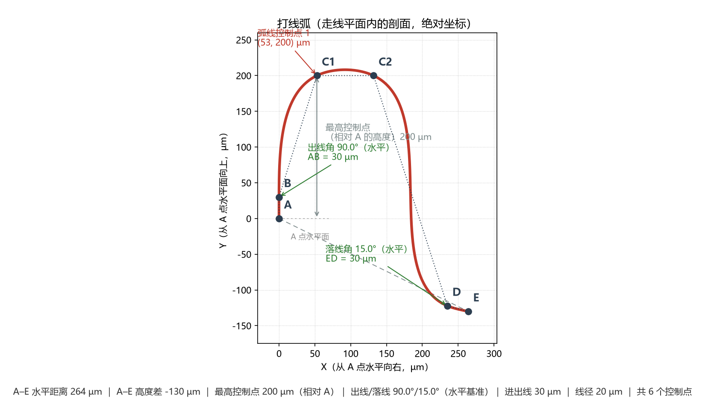

# WireBonder — FreeCAD 打线（金线）辅助插件

[English](README-en.md)


选中任意**两个平面**，插件会构造一个“平分平面”，并在该平面内画出一条连接两个质心的**打线弧（wire loop）**，最后按设定的**金线直径**把它放样成实体（可选生成两个焊球）。

金线直径、弧线控制点等全部是**参数化属性**，改完自动重建几何。

> 版本 **0.14.0** ｜ 已在 **FreeCAD 1.1.3 + Python 3.11.14 + PySide6 6.8.3** 上实测通过。

---

## 1. 几何构造规则

### 1.1 五个步骤

给定两个被选中的平面 $F_1$、$F_2$：

1. 取两个平面的**质心** $\mathbf{C}_1$、$\mathbf{C}_2$，得到连线方向

$$
\mathbf{d} = \mathrm{normalize}\left(\mathbf{C}_2 - \mathbf{C}_1\right),
\qquad
L = \left\lVert \mathbf{C}_2 - \mathbf{C}_1 \right\rVert
$$

2. 取两个平面的**法线** $\mathbf{n}_1$、$\mathbf{n}_2$，先把它们统一到同一半球
   （夹角大于 $90^\circ$ 时翻转 $\mathbf{n}_2$），再取**角平分方向**

$$
\mathbf{b} = \mathrm{normalize}\left(\mathbf{n}_1 + \mathbf{n}_2\right)
$$

3. 目标平面 $P$（走线平面 / 平分平面）由 $\mathbf{d}$ 与 $\mathbf{b}$ 张成，它同时通过
   $\mathbf{C}_1$ 与 $\mathbf{C}_2$；
4. 在 $P$ 内建立**局部坐标系**：$\mathbf{x}$ 轴沿 $\mathbf{d}$，$\mathbf{y}$ 轴取
   $\mathbf{b}$ 在 $P$ 内的正交分量（Gram-Schmidt），$\mathbf{z}$ 轴为平面法向
   $\mathbf{z} = \mathbf{x} \times \mathbf{y}$。若设置了**走线平面偏转角** $\theta$
   （默认 $0^\circ$），则把 $\mathbf{y}$、$\mathbf{z}$ 轴**绕 $\mathbf{x}$ 轴（连线）旋转
   $\theta$**：即走线平面以连线为轴偏转，$0^\circ$ 时与原平分平面完全重合；
5. 在 $P$ 内生成打线弧：从 $\mathbf{C}_1$ 出线（陡升）→ 拱顶 → 平缓落回 $\mathbf{C}_2$；
6. 用直径为 $d_{\text{wire}}$（属性 `WireDiameter`）的圆沿弧线放样，得到金线实体；
   可选在两个质心处生成焊点凸起。

两个典型平面（两个水平焊盘，法线都朝 $+Z$）会得到**竖直的平分平面**；两个倾斜的焊盘会得到按法线角平分方向倾斜的平面。

### 1.2 走线坐标系（打线机视角）

弧线的二维坐标**不沿质心连线 $A$–$E$ 布置**，而是按打线机编程的视角布置 ——
见 [`core.horizontal_frame()`](WireBonder/core.py)，它返回一个 `LoopFrame`：

$$
\begin{aligned}
\mathbf{x} &= \mathrm{normalize}\left(\mathbf{y} \times \mathbf{z}\right)
  &&\text{水平轴：起点焊盘平面 } \cap \text{ 走线平面 的交线}\\[2pt]
\mathbf{y} &= \mathrm{normalize}\left(\mathbf{n}_1 - (\mathbf{n}_1 \cdot \mathbf{z})\,\mathbf{z}\right)
  &&\text{高度轴：该水平线在走线平面内的垂线}
\end{aligned}
$$

| 轴 | 含义 |
| --- | --- |
| **$\mathbf{x}$（水平）** | 「起点焊盘平面 $\cap$ 走线平面」的**交线**方向 —— 即“焊盘表面上、朝着另一个焊盘”的方向，是最直观的水平基准；从 $A$ 起算，$0 \to \mathrm{span}_x$ |
| **$\mathbf{y}$（高度）** | $\mathbf{x}$ 在走线平面内的**垂线**，正方向取与起点焊盘法线 $\mathbf{n}_1$ **接近**的一侧；因此 $+\mathbf{y}$ 永远**背离焊盘**，正高度不会扎进焊盘里 |

$E$ 点在这套坐标系里的坐标就是：

$$
\mathrm{span}_x = L \left(\mathbf{x}_{\text{dir}} \cdot \mathbf{x}\right),
\qquad
\mathrm{span}_y = L \left(\mathbf{x}_{\text{dir}} \cdot \mathbf{y}\right)
$$

（$\mathrm{span}_x$ = 两焊盘的“水平”距离，恒为正；$\mathrm{span}_y$ = $E$ 相对 $A$ 的高度差，第二个焊盘更低时为负。）

**为什么这样取**：只要起点焊盘是平的，**同一条弧线的水平基准就固定不变**，
与第二个焊盘的高低无关；这正是打线机的编程基准（角度以水平面为准，而非以两焊盘连线为准）。

> **退化保护**：$\mathbf{n}_1 \parallel \mathbf{z}$（起点焊盘平面与走线平面平行 → 两平面没有
> 交线）或 $\mathrm{span}_x \le 0$ 时，代码会抛 `WireBondError` 并提示换一个平面与走线平面
> 相交的焊盘。

### 1.3 每一个控制点的逻辑

弧线由 **$4 + N$ 个控制点**构成，$N$ 来自参数 `LoopPoints`。记
$\ell$ = 进出线距离（`LeadDistance`）、$\theta_R$ / $\theta_F$ = 出线 / 落线角度
（**以水平面为基准**）、$r_i$ / $h_i$ = `LoopPoints` 的第 $i$ 项。

| 控制点 | $x$（水平） | $y$（高度） | 逻辑 |
| --- | --- | --- | --- |
| **$A$** 起点 | $0$ | $0$ | 固定落在**第一个焊盘质心 $\mathbf{C}_1$**，一切坐标的原点 |
| **$B$** 上起点 | $\ell \cos \theta_R$ | $\ell \sin \theta_R$ | 从 $A$ 沿**出线角 $\theta_R$** 的射线前进 $\ell$。$\ell = 0$ 时 $B$ 与 $A$ 重合，弧线就从焊盘上直接起拱 |
| **弧线控制点 $i$** | $r_i \cdot \mathrm{span}_x$ | $h_i$ | 用户给出的中间点：$r_i$ 是**沿水平跨度的位置比例**（$0 = A$，$1 = E$），$h_i$ 是**相对 $A$ 点水平面的绝对高度**。1 个点即传统弧顶；多点可描述平顶 / 直线下降 |
| **$D$** 上终点 | $\mathrm{span}_x - \ell \cos \theta_F$ | $\mathrm{span}_y + \ell \sin \theta_F$ | 从 $E$ 沿**落线角 $\theta_F$** 的射线（朝 $A$）回退 $\ell$。$y$ 里带上 $\mathrm{span}_y$ 是因为 $E$ 本身可能高于 / 低于 $A$ |
| **$E$** 终点 | $\mathrm{span}_x$ | $\mathrm{span}_y$ | 固定落在**第二个焊盘质心 $\mathbf{C}_2$** |

几点需要特别注意：

- **两个角度都以水平面为基准**，$0^\circ$ 水平、$90^\circ$ 正上方、$180^\circ$ 水平反向；
  **不随两焊盘高度差变化**（旧方案以 $A$–$E$ 连线为基准，焊盘不等高时同一角度会得到不同的实际陡峭程度）；
- **$h_i$ 是绝对高度**（相对 $A$ 点水平面，$A$ 计为 $0$），不是“相对 $A$–$E$ 连线的高度”。
  只要起点焊盘是平的，“水平面”就是焊盘表面所在平面，所以即使第二个焊盘更低，同一个高度值
  代表的离面距离也不变；
- $|AB| = |ED| = \ell$ **精确成立**，因为 $\ell$ 是沿射线量取的距离，与角度无关；
- **非法的控制点会被自动保护**（`core._spread_positions()`）：按 $r_i$ 稳定排序 → 夹到
  $(0,\ \mathrm{span}_x)$ 内 → 相邻点至少间隔 $0.002\,\mathrm{span}_x$（点太多放不下时自动
  缩小间距而**不报错**）；$B$ 被夹到第一个控制点之前、$D$ 夹到最后一个之后，
  **保证 $x$ 严格递增**（样条插值的硬性要求）。

每个控制点最后映射回三维：

$$
\mathbf{P}(x,\, y) = \mathbf{A} + x\,\hat{\mathbf{x}} + y\,\hat{\mathbf{y}}
$$

### 1.4 示例：控制点逐个对照



图中的参数为：水平跨度 $\mathrm{SPAN} = 264\ \text{µm}$、高度差
$\mathrm{HEIGHT} = -130\ \text{µm}$（$E$ 比 $A$ **低** $130\ \text{µm}$）、进出线距离
$\ell = 30\ \text{µm}$、出线角 $\theta_R = 90^\circ$（竖直）、落线角
$\theta_F = 15^\circ$、$\mathrm{LOOP\_POINTS} = [(0.2,\ 200),\ (0.5,\ 200)]$
（两个点、等高 → 近似**平顶**）。它给出 6 个控制点：

| 控制点 | 来源（公式） | $x$ (µm) | $y$ (µm) | 对应图中的位置 |
| --- | --- | --- | --- | --- |
| **$A$** | 质心 $\mathbf{C}_1$，原点 | $0.00$ | $0.00$ | 左下角，落在「A 点水平面」虚线上 |
| **$B$** | $A + 30\left(\cos 90^\circ,\ \sin 90^\circ\right)$ | $0.00$ | $30.00$ | $A$ 的**正上方** $30\ \text{µm}$（出线角 $90^\circ$ 所以水平分量为 $0$，与 $A$ 同一竖直线上） |
| **$C_1$** | $r = 0.2$，$h = 200$ | $52.80$ | $200.00$ | 平台左端（$0.2 \times 264 = 52.8$） |
| **$C_2$** | $r = 0.5$，$h = 200$ | $132.00$ | $200.00$ | 平台右端（$0.5 \times 264 = 132$），与 $C_1$ **等高**所以顶部平坦 |
| **$D$** | $E - 30\left(\cos 15^\circ,\ -\sin 15^\circ\right)$ | $235.02$ | $-122.24$ | 落线段的起点；$y = -130 + 30\sin 15^\circ = -122.24$ |
| **$E$** | 质心 $\mathbf{C}_2$ | $264.00$ | $-130.00$ | 右下角，比 $A$ 低 $130\ \text{µm}$，落在 $A$–$E$ 虚线的末端 |

图上还能读到三个派生量：

- **最高控制点 $200\ \text{µm}$** —— 两个控制点等高，竖直箭头从 $A$ 点水平面量到拱顶；
- **出线角 $90^\circ$ / 落线角 $15^\circ$** —— 绿色标注，均以**水平基准**为准（角标后写明「水平」）；
  图中同时画出这两条射线（$AB$、$ED$ 的虚线）；
- **曲线最高点 $208.2\ \text{µm}$，比设定最高点高 $+4.1\%$** —— 这是样条在控制点之间的正常
  过冲，并非参数错误。

> **换成单点弧顶**：把 `LOOP_POINTS` 改成 `[(0.4, 200)]`（一个点）即退化为经典的 5 点弧线，
> 此时 $r$ 相当于旧 `PeakRatio`、$h$ 相当于旧 `Clearance`，与 v0.13.0 之前的形状**逐位一致**。
> **换成平顶 / 直线下降**：见下方 §3 的 `loop_points` 示例。

### 1.5 插值

控制点经 `Part.BSplineCurve.interpolate()`（弦长参数化的自然三次样条）插值成平滑样条，
因此曲线**严格穿过全部控制点、包括两个质心**，并**整体落在走线平面内**：

$$
\Bigl\lVert \mathbf{P}(0) - \mathbf{C}_1 \Bigr\rVert < 10^{-9}\ \text{mm},
\qquad
\Bigl\lVert \mathbf{P}(1) - \mathbf{C}_2 \Bigr\rVert < 10^{-9}\ \text{mm}
$$

> **过冲是正常现象**：样条在控制点之间会略微超出设定值，因此「最高控制点」与「曲线最高点」
> 并不相等：

$$
\delta = \max_{t \in [0,1]} y(t) - \max_i h_i
$$

> 实测单点弧顶（$[(0.4, 200)]$）只有 $\delta / h \approx +0.02\%$，而上图的**两点平顶**
> 达 $+4.1\%$ —— 因为平顶的两端控制点相距较远、中间没有支撑；控制点越密过冲越小。
> 需要精确控制顶部高度时，可在该段加密控制点（例如把平顶改为 3 点）。

---

## 2. 使用

1. 在 3D 视图中选中**两个面**（按住 `Ctrl` 多选；可以来自同一个对象，也可以来自两个对象）；
2. 工具栏 **Wire Bonding ▸ Create Wire Bond**（或菜单同名项）；
3. 在弹出的面板中设置参数，点 **OK**；
4. 生成 `WireBond` 对象（金线 + 焊球，金色）；若勾选，还会生成 `WireBondPlane`
   **平分辅助面**（半透明绿色，生成后自动隐藏，需要时可在模型树里手动显示）。

### 面板参数

| 参数 | 默认值 | 说明 |
| --- | --- | --- |
| 金线直径 | 20 µm | 放样截面直径，即金线直径 |
| 弧线控制点 | 一行 `0.40 / 200 µm` | 表格：每行一个控制点的**位置比例**（0=起点, 1=终点，沿水平跨度）与**高度**（相对起点焊盘水平面的绝对高度）。一行即传统弧顶，多行可描述平顶 / 直线下降（`4+N` 点样条） |
| 走线平面偏转角 | 0° | 走线平面绕两质心连线的偏转角（−180°~180°）；**0° 与原平分平面完全重合** |
| 出线角度 | 75° | 金线离开第一个焊盘的方向，以**水平面**为基准（0° 水平、90° 正上方、180° 水平反向，0–180°） |
| 落线角度 | 15° | 金线到达第二个焊盘的方向，以**水平面**为基准（0° 水平、90° 正上方、180° 水平反向，0–180°） |
| 起点焊球 (C1) | 球形 | C1 处凸点形状：**无 / 球形 / 圆台** |
| 终点焊球 (C2) | 球形 | C2 处凸点形状，可与起点不同（例如芯片端球形、基板端圆台） |
| 进出线距离 | 30 µm | 每个焊盘沿出线/落线射线到控制点 B / D 的距离 |
| 焊球直径 | 50 µm | 球形时为球径（约为线径 2.5 倍）；圆台时兼作凸点高度 |
| 上底直径 | 50 µm | 圆台远离焊盘一端的直径（仅选「圆台」时显示） |
| 下底直径 | 50 µm | 圆台贴着焊盘一端的直径（仅选「圆台」时显示） |
| 生成金线实体 | 否 | 勾选后生成真实直径的实体；直径很小时放样较慢 |
| 同时显示中心线 | 是 | 只生成中心线时也可显示，便于在小直径下看清走线 |
| 创建平分辅助面 | 否 | 额外生成平分平面（构造参考，生成后自动隐藏）；**默认不创建**，可减少对象数量 |

> **面板会记住上次的设置**：点 OK 后当前参数会保存到 FreeCAD 用户参数
> （`User parameter:BaseApp/Preferences/Mod/WireBonder`），下次打开面板时自动回填，
> 包括金线直径、弧线控制点、走线平面偏转角、焊球直径与所有复选框。
> 想回到内置默认值，点面板底部的 **恢复默认值** 按钮（同时清除已保存的设置），
> 或在 **Tools ▸ Edit parameters ▸ BaseApp ▸ Preferences ▸ Mod ▸ WireBonder** 中手动删除。

### 参数输入框

所有数值输入框复用的是 **FreeCAD 属性视图里的那种输入框**（`Gui::QuantitySpinBox`），因此可以直接使用它的三项便利：

- **自由切换单位**：单位是数值的一部分，输入 `0.02 mm`、`20 um`、`1 thou` 都可以，
  显示单位会随之变化（也可右键看换算）。长度类的「金线直径」「焊球直径」以及**弧线控制点的
  高度列**支持任意长度单位，角度类的「走线平面偏转角」「出线/落线角度」支持 `deg` / `rad`；
- **支持表达式**：提交时会求值，例如 `10*2`、`0.25*2`、`5um*4`，也可以引用
  `Spreadsheet` 单元格；
- **滚轮不会误改数值**：鼠标停在输入框上滚动滚轮**不会**改变数值（原生的行为会），
  事件会转交给面板，所以面板照常滚动。

无单位的比例字段（**弧线控制点的位置比例列**）同样支持表达式。

### 面板布局

- **自动滚动**：面板内容超出可用高度时，右侧出现垂直滚动条，任何控件都不会被窗口截断；
  内容宽度会自动适应面板，不出现横向滚动条。
- **分组可折叠**：点击分组标题（**选中的平面** / **金线参数** / **输出选项**）即可折叠或展开，
  标题前的 **▾** 表示展开、**▸** 表示折叠。屏幕空间不足时可收起不关心的分组。
  折叠状态会被记住（立即保存，无需点 OK；「恢复默认值」不会重置它）。

> 20 µm 的金线在整机尺度（几十毫米）下几乎不可见，所以默认**只生成中心线**；
> 需要真实实体时勾选“生成金线实体”。
>
> 若选中的面位于 `PartDesign::Body` 内，Report view 会出现
> `Link(s) to object(s) ... go out of the allowed scope` 的**警告**（非错误），几何结果不受影响；
> 面板会自动检测并在顶部显示橙色提示，命令也会在 Report view 输出同样的中文说明。

### 参数化修改

生成后可直接在**属性编辑器**里改 `WireDiameter`、**`LoopPoints`**、`PlaneRotation`、`RiseAngle`、`FallAngle`、`LeadDistance`、`MakeSolid`、`ShowCentreline`、`StartBallMode`、`EndBallMode`、`BallDiameter` 等，几何会自动重建；也可以改 `Face1` / `Face2` 换用其他平面。
`LoopPoints` 是 `ratio,height;...` 形式的文本（height 以 mm 计）；一个点即传统弧顶，多个点构成 `4+N` 点样条。

---

## 3. 脚本 / 控制台用法

### 3.1 直接调用几何核心

几何核心不依赖 GUI，可直接调用：

```python
import sys
sys.path.append(r"C:\Users\<you>\AppData\Roaming\FreeCAD\v1-1\Mod\WireBonder")

import FreeCAD as App
from WireBonder import core

doc = App.ActiveDocument
face1 = doc.getObject("Pad1").Shape.Faces[1]   # 任意一个面
face2 = doc.getObject("Pad2").Shape.Faces[1]

result = core.compute_from_faces(
    face1, face2,
    wire_diameter=0.02,         # 20 µm
    loop_points=[(0.40, 0.2)],  # 一个点 = 传统弧顶（高 200 µm）
    rise_angle=75.0,            # 出线角度（以水平面为基准，度）
    fall_angle=15.0,            # 落线角度（以水平面为基准，度）
    lead_distance=0.03,         # 进出线距离 30 µm
    make_solid=False,           # 只算中心线
    ball_diameter=0.05,         # 焊球直径 50 µm
)
# 平顶示例：     loop_points=[(0.35, 0.2), (0.50, 0.2), (0.65, 0.2)]
# 直线下降示例： loop_points=[(0.30, 0.2), (0.50, 0.24), (0.70, 0.20)]
print(result["frame"].length)             # 两质心距离 L
print(result["loop_frame"].span_x)        # 两焊盘水平距离 span_x
print(result["loop_frame"].span_y)        # E 相对 A 的高度差 span_y
print(result["points2d"])                 # 弧线控制点 (x, y)，绝对坐标，单位 mm
print(result["centre_line"])              # 中心线 Wire
print(result["solid"])                    # 金线实体 Solid（make_solid=True 时）
print(result["balls"])                    # 两个焊球 Solid
print(result["plane"])                    # 平分平面 Face（辅助面用）
```

### 3.2 创建参数化对象

也可以用 `WireBonder.features.WireBondFeature` 直接创建参数化对象：

```python
from WireBonder import features

obj = doc.addObject("Part::FeaturePython", "WireBond")
features.WireBondFeature(obj)
features.ViewProviderWireBond(obj.ViewObject)   # 金色显示样式
obj.Face1 = (doc.getObject("Pad1"), "Face6")
obj.Face2 = (doc.getObject("Pad2"), "Face6")
obj.LoopPoints = "0.4,0.2"      # 位置比例 0.40，高度 0.2 mm（200 um）
obj.WireDiameter = "20 um"
obj.BallDiameter = "50 um"
obj.StartBallMode = "sphere"
obj.EndBallMode = "frustum"
doc.recompute()
```

---

## 4. 多语言

插件界面文字**跟随 FreeCAD 的语言设置**：

| FreeCAD 语言 | 插件显示 |
| --- | --- |
| 中文（简体 / 任意 `zh*`） | **中文** |
| English | **英文** |
| 其它任意语言（德语、日语…） | **英文**（回退） |

语言探测顺序（[`i18n.detect_language()`](WireBonder/i18n.py)）：

1. `FreeCADGui.getLocale()` —— GUI 环境最准确，返回如 `'Chinese (Simplified)'`；
2. 用户参数 `User parameter:BaseApp/Preferences/General` 的 `Language` —— 无 GUI 也能用；
3. `PySide.QtCore.QLocale.system().name()` —— 如 `zh_CN`；
4. 全部失败 → 英文。

### 切换语言（无需重启）

在 FreeCAD 里改语言（**Edit ▸ Preferences ▸ General ▸ Language**）后**立即生效**，
工作台名称、工具栏/菜单按钮、参数面板全部随之切换，不需要重启 FreeCAD。

实现要点（[`language_monitor.py`](WireBonder/language_monitor.py)）：

- **两个信号源同时监视**：`Language` 用户参数（偏好设置对话框写入）与 `FreeCADGui.getLocale()`（GUI 实际使用的值），二者可能各自变化；
- 参数观察者 `ParamGet(...).Attach()` 提供即时回调，另有一个 1.5 s 轮询定时器兜底；
- 检测到 `Language` 参数变化时，插件调用 `FreeCADGui.setLocale()` 把新语言推给 GUI，使 FreeCAD 自身界面与插件保持一致 —— **只改参数并不会自动更新 `getLocale()`**，这是关键；
- 变化后重新注册工作台（`Gui.removeWorkbench` + `Gui.addWorkbench`）以重建菜单；
- 按钮文字需**延后一个事件循环**再设置：FreeCAD 在处理 `LanguageChange` 事件时会把 QAction 文字重置为未翻译字符串，立即设置会被覆盖，因此用 `QTimer.singleShot(0, ...)` 延后写入。

启动日志中会记录生效语言与切换动作：

```log
[2026-09-22 12:04:01] language   = zh
...
WireBond: language changed zh -> en
```

### 增加新语言 / 扩展词条

1. 打开 [`WireBonder/i18n.py`](WireBonder/i18n.py)，中文词条表 `_ZH` 以**英文原文为 key**；
2. 增加一种语言：新增 `_JA = { "Wire Bond": "ワイヤボンド", ... }`，并把它加入
   `_TRANSLATIONS` 与 `LANGUAGES`，同时在 `_normalize()` 中识别该语言代码；
3. 源码中新增的用户可见字符串一律写成 `_("English text")` 形式。

> 未翻译的条目会**自动回退为英文原文**，不会显示空白或 key。

### 控制台用法

```python
from WireBonder import i18n
print(i18n.language())          # 'zh' 或 'en'（自动探测的结果）
i18n.set_language("en")         # 临时强制英文（None 表示恢复自动探测）
print(i18n.translate("Wire Bond"))
```
